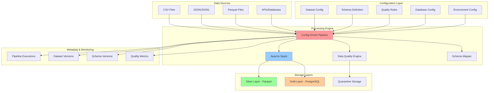
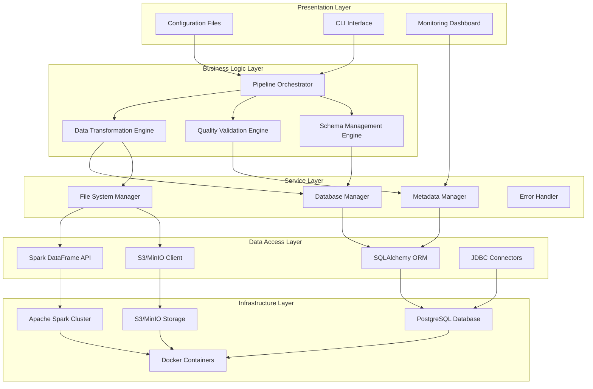
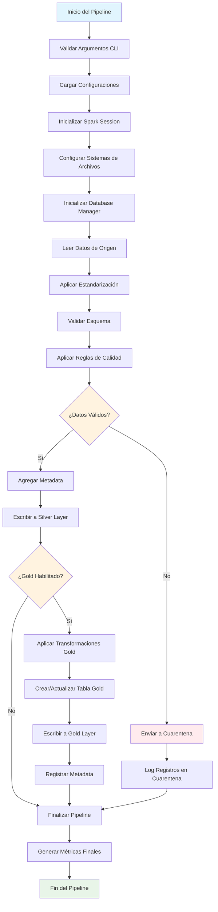
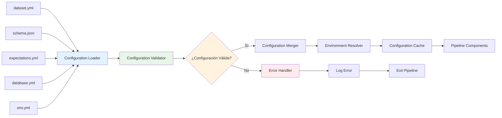
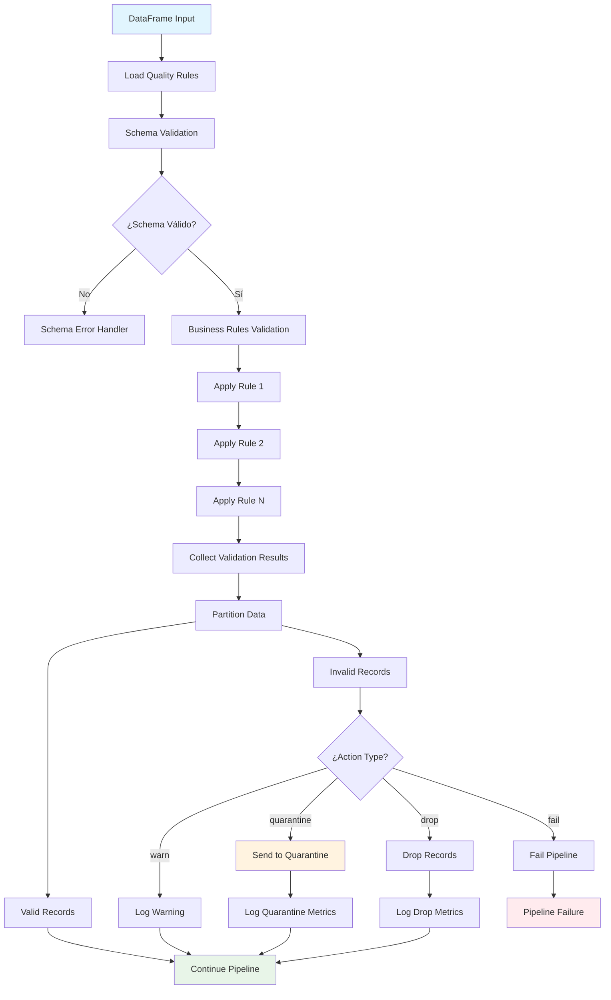
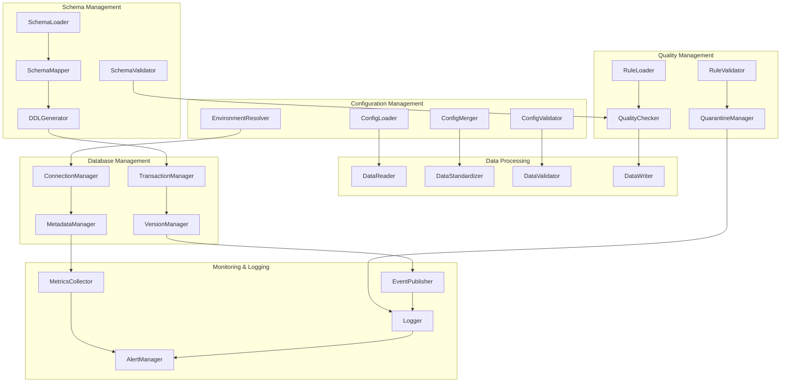
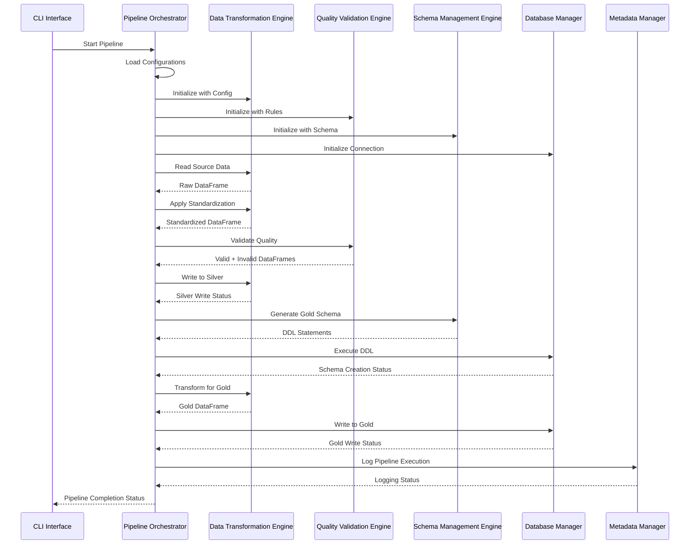
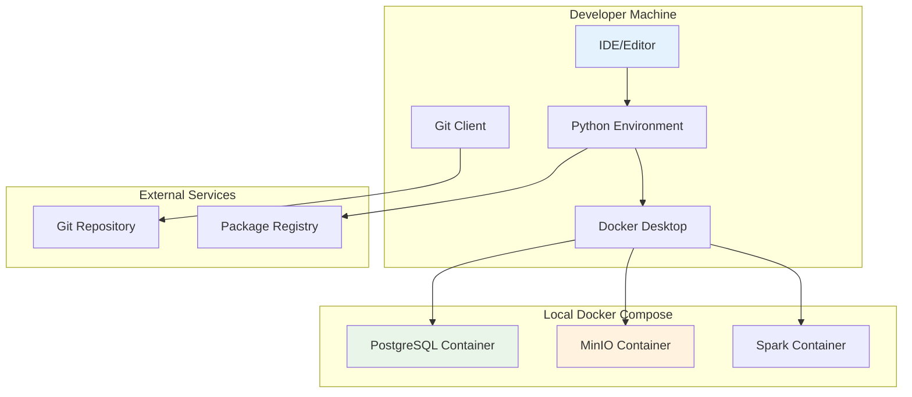
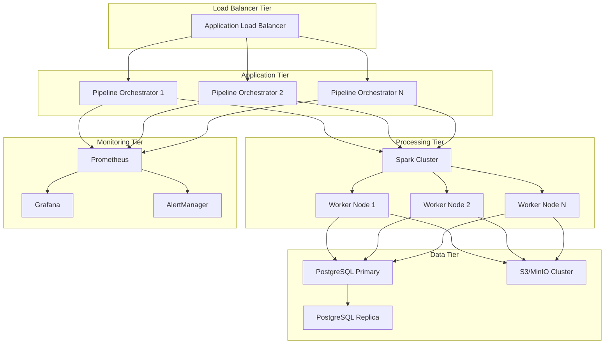

# DOCUMENTACIÓN GENERAL DEL PROYECTO
## MVP Config-Driven Data Pipeline

### ÍNDICE
1. [Visión General del Proyecto](#visión-general-del-proyecto)
2. [Arquitectura Técnica Completa](#arquitectura-técnica-completa)
3. [Diagramas de Flujo y Componentes](#diagramas-de-flujo-y-componentes)
4. [Requisitos Técnicos e Infraestructura](#requisitos-técnicos-e-infraestructura)
5. [Manual de Instalación y Configuración](#manual-de-instalación-y-configuración)
6. [Manual de Despliegue](#manual-de-despliegue)
7. [Guías de Operación](#guías-de-operación)

---

## VISIÓN GENERAL DEL PROYECTO

### Propósito y Objetivos

El **MVP Config-Driven Data Pipeline** es una solución de ingeniería de datos diseñada para democratizar y acelerar el desarrollo de pipelines de datos mediante un enfoque completamente basado en configuración. El sistema permite a los equipos de datos crear, modificar y mantener pipelines complejos sin necesidad de escribir código Python.

#### Objetivos Principales

1. **Reducción del Time-to-Market**: De semanas a horas para nuevos pipelines
2. **Democratización del Desarrollo**: Analistas de datos pueden crear pipelines sin programación
3. **Estandarización de Procesos**: Patrones consistentes y mejores prácticas incorporadas
4. **Escalabilidad y Mantenibilidad**: Arquitectura modular y extensible
5. **Observabilidad Completa**: Trazabilidad y auditoría de extremo a extremo

#### Casos de Uso Principales

- **Ingesta de Datos Financieros**: Procesamiento de transacciones, pagos, facturación
- **ETL de Datos de Marketing**: Campañas, leads, conversiones
- **Pipelines de Datos Operacionales**: Inventarios, logística, recursos humanos
- **Data Warehousing**: Construcción de capas Silver y Gold
- **Compliance y Auditoría**: Trazabilidad completa de transformaciones

### Arquitectura de Alto Nivel



### Principios de Diseño

#### 1. Configuration-First
- **Externalización Completa**: Toda la lógica de negocio en archivos YAML/JSON
- **Versionado Independiente**: Configuraciones versionadas separadamente del código
- **Validación Automática**: Esquemas de validación para todas las configuraciones

#### 2. Separation of Concerns
- **Capa de Configuración**: Define QUÉ hacer
- **Capa de Procesamiento**: Define CÓMO hacerlo
- **Capa de Almacenamiento**: Define DÓNDE guardarlo
- **Capa de Metadata**: Define tracking y auditoría

#### 3. Fail-Fast & Observability
- **Validación Temprana**: Errores detectados antes del procesamiento
- **Logging Exhaustivo**: Cada operación registrada con contexto
- **Métricas en Tiempo Real**: Monitoreo continuo del pipeline

#### 4. Extensibilidad
- **Arquitectura Pluggable**: Nuevos formatos y destinos fácilmente agregables
- **Transformaciones Personalizadas**: Framework para lógica específica
- **Conectores Modulares**: Integración con nuevos sistemas

---

## ARQUITECTURA TÉCNICA COMPLETA

### Arquitectura de Capas Detallada



### Componentes Arquitectónicos Principales

#### 1. Pipeline Orchestrator
```python
class PipelineOrchestrator:
    """
    Componente central que coordina todo el flujo del pipeline
    """
    
    responsibilities = [
        "Inicialización de componentes",
        "Coordinación de flujo de datos",
        "Manejo de errores y recovery",
        "Logging y métricas",
        "Gestión de transacciones"
    ]
    
    dependencies = [
        "ConfigurationManager",
        "DataTransformationEngine", 
        "QualityValidationEngine",
        "SchemaManagementEngine",
        "MetadataManager"
    ]
```

#### 2. Data Transformation Engine
```python
class DataTransformationEngine:
    """
    Motor de transformaciones basado en configuración
    """
    
    capabilities = [
        "Lectura multi-formato (CSV, JSON, Parquet)",
        "Estandarización de datos",
        "Aplicación de transformaciones",
        "Particionado inteligente",
        "Optimización de performance"
    ]
    
    transformation_types = [
        "Renombrado de columnas",
        "Conversión de tipos",
        "Valores por defecto",
        "Deduplicación",
        "Agregaciones",
        "Joins configurables"
    ]
```

#### 3. Quality Validation Engine
```python
class QualityValidationEngine:
    """
    Motor de validación de calidad de datos
    """
    
    validation_types = [
        "Validación de esquema",
        "Reglas de negocio",
        "Checks de integridad",
        "Validación de rangos",
        "Detección de anomalías"
    ]
    
    actions = [
        "quarantine",  # Enviar a cuarentena
        "drop",        # Eliminar registro
        "warn",        # Solo advertir
        "fail"         # Fallar pipeline
    ]
```

#### 4. Schema Management Engine
```python
class SchemaManagementEngine:
    """
    Motor de gestión de esquemas con versionado
    """
    
    features = [
        "Evolución automática de esquemas",
        "Versionado con hash",
        "Generación de DDL",
        "Migración de esquemas",
        "Validación de compatibilidad"
    ]
    
    supported_databases = [
        "PostgreSQL",
        "MySQL",
        "SQL Server",
        "Oracle"  # Futuro
    ]
```

### Patrones Arquitectónicos Implementados

#### 1. Patrón Strategy
```python
# Estrategias de transformación intercambiables
class TransformationStrategy:
    def apply(self, df: DataFrame, config: dict) -> DataFrame:
        pass

class SilverTransformationStrategy(TransformationStrategy):
    def apply(self, df: DataFrame, config: dict) -> DataFrame:
        # Lógica específica para Silver layer
        pass

class GoldTransformationStrategy(TransformationStrategy):
    def apply(self, df: DataFrame, config: dict) -> DataFrame:
        # Lógica específica para Gold layer
        pass
```

#### 2. Patrón Factory
```python
# Factory para crear managers basado en configuración
class ManagerFactory:
    @staticmethod
    def create_database_manager(config: dict) -> DatabaseManager:
        engine_type = config.get('engine', 'postgresql')
        if engine_type == 'postgresql':
            return PostgreSQLManager(config)
        elif engine_type == 'mysql':
            return MySQLManager(config)
        else:
            raise ValueError(f"Unsupported engine: {engine_type}")
```

#### 3. Patrón Observer
```python
# Sistema de eventos para logging y monitoring
class EventPublisher:
    def __init__(self):
        self.observers = []
    
    def subscribe(self, observer):
        self.observers.append(observer)
    
    def notify(self, event_type: str, data: dict):
        for observer in self.observers:
            observer.handle_event(event_type, data)
```

#### 4. Patrón Chain of Responsibility
```python
# Cadena de validaciones de calidad
class QualityValidator:
    def __init__(self):
        self.next_validator = None
    
    def set_next(self, validator):
        self.next_validator = validator
        return validator
    
    def validate(self, df: DataFrame, rule: dict):
        result = self._validate(df, rule)
        if self.next_validator and result.passed:
            return self.next_validator.validate(df, rule)
        return result
```

---

## DIAGRAMAS DE FLUJO Y COMPONENTES

### 1. Flujo Principal del Pipeline



### 2. Flujo de Gestión de Configuraciones



### 3. Flujo de Validación de Calidad



### 4. Arquitectura de Componentes Detallada



### 5. Flujo de Datos Entre Capas



---

## REQUISITOS TÉCNICOS E INFRAESTRUCTURA

### Requisitos de Hardware

#### Entorno de Desarrollo
```yaml
minimum_requirements:
  cpu: "4 cores"
  memory: "8 GB RAM"
  storage: "50 GB SSD"
  network: "Broadband Internet"

recommended_requirements:
  cpu: "8 cores"
  memory: "16 GB RAM"
  storage: "100 GB SSD"
  network: "High-speed Internet"
```

#### Entorno de Producción
```yaml
small_deployment:
  cpu: "8 cores"
  memory: "32 GB RAM"
  storage: "500 GB SSD"
  network: "1 Gbps"
  
medium_deployment:
  cpu: "16 cores"
  memory: "64 GB RAM"
  storage: "1 TB SSD"
  network: "10 Gbps"
  
large_deployment:
  cpu: "32+ cores"
  memory: "128+ GB RAM"
  storage: "2+ TB SSD"
  network: "10+ Gbps"
```

### Requisitos de Software

#### Sistema Operativo
- **Linux**: Ubuntu 20.04+, CentOS 8+, RHEL 8+
- **Windows**: Windows 10/11, Windows Server 2019+
- **macOS**: macOS 11+ (solo desarrollo)

#### Dependencias Core
```yaml
python:
  version: "3.8+"
  packages:
    - pyspark: "3.4.0+"
    - sqlalchemy: "2.0+"
    - psycopg2-binary: "2.9+"
    - pyyaml: "6.0+"
    - pandas: "1.5+"

java:
  version: "11+"
  distribution: "OpenJDK or Oracle JDK"

docker:
  version: "20.10+"
  compose_version: "2.0+"
```

#### Bases de Datos Soportadas
```yaml
postgresql:
  versions: ["12", "13", "14", "15"]
  extensions: ["uuid-ossp", "pg_stat_statements"]
  
mysql:
  versions: ["8.0+"]
  status: "Planned"
  
sql_server:
  versions: ["2019+"]
  status: "Planned"
```

#### Almacenamiento de Objetos
```yaml
s3_compatible:
  aws_s3: "Fully Supported"
  minio: "Fully Supported"
  azure_blob: "Planned"
  gcs: "Planned"
```

### Arquitectura de Infraestructura

#### Arquitectura de Desarrollo



#### Arquitectura de Producción



### Estimaciones de Capacidad

#### Throughput Esperado
```yaml
small_datasets:
  size: "< 1 GB"
  records: "< 10M"
  processing_time: "< 5 minutes"
  
medium_datasets:
  size: "1-10 GB"
  records: "10M-100M"
  processing_time: "5-30 minutes"
  
large_datasets:
  size: "10-100 GB"
  records: "100M-1B"
  processing_time: "30-120 minutes"
  
xlarge_datasets:
  size: "> 100 GB"
  records: "> 1B"
  processing_time: "> 2 hours"
```

#### Escalabilidad
```yaml
horizontal_scaling:
  spark_workers: "Auto-scaling based on workload"
  database_replicas: "Read replicas for query performance"
  storage: "Unlimited with S3/MinIO"
  
vertical_scaling:
  memory: "Up to 1TB per node"
  cpu: "Up to 128 cores per node"
  storage: "Up to 100TB per node"
```

---

## MANUAL DE INSTALACIÓN Y CONFIGURACIÓN

### Instalación Paso a Paso

#### 1. Preparación del Entorno

```bash
# 1.1. Verificar requisitos del sistema
python --version  # Debe ser 3.8+
java -version     # Debe ser 11+
docker --version  # Debe ser 20.10+

# 1.2. Crear directorio del proyecto
mkdir mvp-config-driven
cd mvp-config-driven

# 1.3. Clonar repositorio
git clone <repository-url> .

# 1.4. Crear entorno virtual Python
python -m venv venv

# 1.5. Activar entorno virtual
# En Linux/macOS:
source venv/bin/activate
# En Windows:
venv\Scripts\activate
```

#### 2. Instalación de Dependencias

```bash
# 2.1. Actualizar pip
pip install --upgrade pip

# 2.2. Instalar dependencias Python
pip install -r requirements.txt

# 2.3. Verificar instalación de PySpark
python -c "import pyspark; print(pyspark.__version__)"

# 2.4. Verificar instalación de SQLAlchemy
python -c "import sqlalchemy; print(sqlalchemy.__version__)"
```

#### 3. Configuración de Infraestructura

```bash
# 3.1. Iniciar servicios con Docker Compose
docker-compose up -d

# 3.2. Verificar servicios
docker-compose ps

# 3.3. Verificar conectividad a PostgreSQL
docker exec -it mvp-postgres psql -U postgres -d data_warehouse -c "SELECT version();"

# 3.4. Verificar conectividad a MinIO
curl http://localhost:9000/minio/health/live
```

#### 4. Configuración Inicial

```bash
# 4.1. Crear estructura de directorios
mkdir -p data/{raw,silver,quarantine}
mkdir -p logs
mkdir -p config/datasets

# 4.2. Configurar variables de entorno
cp .env.example .env
# Editar .env con configuraciones específicas

# 4.3. Inicializar base de datos
python scripts/init_database.py

# 4.4. Verificar configuración
python scripts/verify_setup.py
```

### Configuración Detallada

#### 1. Configuración de Base de Datos

```yaml
# config/database.yml
default:
  engine: postgresql
  host: localhost
  port: 5432
  database: data_warehouse
  username: postgres
  password: postgres123
  schema: gold

development:
  engine: postgresql
  host: postgres  # Docker service name
  port: 5432
  database: data_warehouse
  username: postgres
  password: postgres123
  schema: gold

production:
  engine: postgresql
  host: ${DB_HOST}
  port: ${DB_PORT}
  database: ${DB_NAME}
  username: ${DB_USER}
  password: ${DB_PASSWORD}
  schema: ${DB_SCHEMA}
  
  # Configuración de pool de conexiones
  pool_size: 20
  max_overflow: 40
  pool_timeout: 30
  pool_recycle: 3600

# Configuración de tablas
table_settings:
  table_prefix: ""
  table_suffix: ""
  version_format: "%Y%m%d_%H%M%S"
  
  default_transformations:
    exclude_columns: ["_run_id", "_ingestion_ts", "year", "month"]
    add_audit_columns: true
```

#### 2. Configuración de Entorno

```yaml
# config/env.yml
spark:
  app_name: "ConfigDrivenPipeline"
  master: "local[*]"
  executor_memory: "2g"
  driver_memory: "1g"
  executor_cores: 2
  
  # Configuración S3A
  s3a:
    endpoint: "http://localhost:9000"
    access_key: "minioadmin"
    secret_key: "minioadmin"
    path_style_access: true
    ssl_enabled: false

paths:
  silver_base: "./data/silver"
  quarantine_base: "./data/quarantine"
  temp_base: "./data/temp"

s3:
  endpoint: "http://localhost:9000"
  access_key: "minioadmin"
  secret_key: "minioadmin"
  bucket_raw: "raw"
  bucket_silver: "silver"
  bucket_quarantine: "quarantine"

timezone: "America/Bogota"

logging:
  level: "INFO"
  format: "%(asctime)s - %(name)s - %(levelname)s - %(message)s"
  file: "logs/pipeline.log"
```

#### 3. Configuración de Dataset de Ejemplo

```yaml
# config/datasets/payments_v1/dataset.yml
id: payments_v1
domain: finanzas

source:
  input_format: csv
  path: "data/raw/payments/*.csv"
  options:
    header: "true"
    inferSchema: "true"
    delimiter: ","

standardization:
  timezone: America/Bogota
  
  rename:
    - { from: customerId, to: customer_id }
    - { from: paymentId, to: payment_id }
  
  casts:
    - { column: amount, to: "decimal(18,2)" }
    - { column: payment_date, to: "timestamp", format_hint: "yyyy-MM-dd HH:mm:ss" }
  
  defaults:
    - { column: currency, value: "CLP" }
  
  deduplicate:
    key: [payment_id]
    order_by: [updated_at desc]

quality:
  expectations_ref: config/datasets/payments_v1/expectations.yml
  quarantine: data/quarantine/payments_v1/

schema:
  ref: config/datasets/payments_v1/schema.json
  mode: strict

output:
  silver:
    format: parquet
    path: "data/silver/payments_v1/"
    partition_by: [year, month]
    partition_from: payment_date
    mode: overwrite_dynamic
  
  gold:
    enabled: true
    database_config: "config/database.yml"
    environment: "development"
    exclude_columns: ["_run_id", "_ingestion_ts"]
```

### Scripts de Utilidad

#### 1. Script de Verificación de Setup

```python
# scripts/verify_setup.py
#!/usr/bin/env python3
"""
Script para verificar que el setup esté correcto
"""

import sys
import os
import yaml
import psycopg2
from pyspark.sql import SparkSession

def verify_python_dependencies():
    """Verificar dependencias Python"""
    try:
        import pyspark
        import sqlalchemy
        import psycopg2
        import yaml
        print("✓ Dependencias Python instaladas correctamente")
        return True
    except ImportError as e:
        print(f"✗ Error en dependencias Python: {e}")
        return False

def verify_spark():
    """Verificar Spark"""
    try:
        spark = SparkSession.builder.appName("VerifySetup").getOrCreate()
        df = spark.range(10)
        count = df.count()
        spark.stop()
        print(f"✓ Spark funcionando correctamente (test count: {count})")
        return True
    except Exception as e:
        print(f"✗ Error en Spark: {e}")
        return False

def verify_database():
    """Verificar conexión a base de datos"""
    try:
        conn = psycopg2.connect(
            host="localhost",
            port=5432,
            database="data_warehouse",
            user="postgres",
            password="postgres123"
        )
        cursor = conn.cursor()
        cursor.execute("SELECT version();")
        version = cursor.fetchone()[0]
        conn.close()
        print(f"✓ PostgreSQL conectado: {version[:50]}...")
        return True
    except Exception as e:
        print(f"✗ Error en PostgreSQL: {e}")
        return False

def verify_minio():
    """Verificar MinIO"""
    try:
        import requests
        response = requests.get("http://localhost:9000/minio/health/live")
        if response.status_code == 200:
            print("✓ MinIO funcionando correctamente")
            return True
        else:
            print(f"✗ MinIO no responde: {response.status_code}")
            return False
    except Exception as e:
        print(f"✗ Error en MinIO: {e}")
        return False

def verify_configurations():
    """Verificar archivos de configuración"""
    config_files = [
        "config/database.yml",
        "config/env.yml",
        "config/schema_mapping.yml"
    ]
    
    all_good = True
    for config_file in config_files:
        if os.path.exists(config_file):
            try:
                with open(config_file, 'r') as f:
                    yaml.safe_load(f)
                print(f"✓ {config_file} válido")
            except Exception as e:
                print(f"✗ Error en {config_file}: {e}")
                all_good = False
        else:
            print(f"✗ {config_file} no encontrado")
            all_good = False
    
    return all_good

def main():
    """Función principal"""
    print("Verificando setup del MVP Config-Driven Pipeline...")
    print("=" * 50)
    
    checks = [
        ("Dependencias Python", verify_python_dependencies),
        ("Apache Spark", verify_spark),
        ("PostgreSQL", verify_database),
        ("MinIO", verify_minio),
        ("Configuraciones", verify_configurations)
    ]
    
    results = []
    for name, check_func in checks:
        print(f"\nVerificando {name}...")
        result = check_func()
        results.append(result)
    
    print("\n" + "=" * 50)
    print("RESUMEN:")
    
    all_passed = all(results)
    if all_passed:
        print("✓ Todas las verificaciones pasaron. El sistema está listo!")
        sys.exit(0)
    else:
        print("✗ Algunas verificaciones fallaron. Revisar errores arriba.")
        sys.exit(1)

if __name__ == "__main__":
    main()
```

#### 2. Script de Inicialización de Base de Datos

```python
# scripts/init_database.py
#!/usr/bin/env python3
"""
Script para inicializar la base de datos con esquemas y tablas necesarias
"""

import psycopg2
from psycopg2.extensions import ISOLATION_LEVEL_AUTOCOMMIT

def create_database():
    """Crear base de datos si no existe"""
    try:
        # Conectar a PostgreSQL sin especificar base de datos
        conn = psycopg2.connect(
            host="localhost",
            port=5432,
            user="postgres",
            password="postgres123"
        )
        conn.set_isolation_level(ISOLATION_LEVEL_AUTOCOMMIT)
        cursor = conn.cursor()
        
        # Verificar si la base de datos existe
        cursor.execute("SELECT 1 FROM pg_database WHERE datname='data_warehouse'")
        exists = cursor.fetchone()
        
        if not exists:
            cursor.execute("CREATE DATABASE data_warehouse")
            print("✓ Base de datos 'data_warehouse' creada")
        else:
            print("✓ Base de datos 'data_warehouse' ya existe")
        
        conn.close()
        return True
    except Exception as e:
        print(f"✗ Error creando base de datos: {e}")
        return False

def create_schemas():
    """Crear esquemas necesarios"""
    try:
        conn = psycopg2.connect(
            host="localhost",
            port=5432,
            database="data_warehouse",
            user="postgres",
            password="postgres123"
        )
        cursor = conn.cursor()
        
        schemas = ["gold", "metadata"]
        
        for schema in schemas:
            cursor.execute(f"CREATE SCHEMA IF NOT EXISTS {schema}")
            print(f"✓ Esquema '{schema}' creado/verificado")
        
        conn.commit()
        conn.close()
        return True
    except Exception as e:
        print(f"✗ Error creando esquemas: {e}")
        return False

def create_metadata_tables():
    """Crear tablas de metadata"""
    try:
        conn = psycopg2.connect(
            host="localhost",
            port=5432,
            database="data_warehouse",
            user="postgres",
            password="postgres123"
        )
        cursor = conn.cursor()
        
        # Tabla de ejecuciones de pipeline
        cursor.execute("""
            CREATE TABLE IF NOT EXISTS metadata.pipeline_executions (
                execution_id VARCHAR(255) PRIMARY KEY,
                dataset_id VARCHAR(255) NOT NULL,
                status VARCHAR(50) NOT NULL,
                start_time TIMESTAMP NOT NULL,
                end_time TIMESTAMP,
                records_processed INTEGER,
                records_quarantined INTEGER,
                error_message TEXT,
                created_at TIMESTAMP DEFAULT CURRENT_TIMESTAMP
            )
        """)
        
        # Tabla de versiones de dataset
        cursor.execute("""
            CREATE TABLE IF NOT EXISTS metadata.dataset_versions (
                id SERIAL PRIMARY KEY,
                dataset_id VARCHAR(255) NOT NULL,
                version VARCHAR(255) NOT NULL,
                execution_id VARCHAR(255) NOT NULL,
                layer VARCHAR(50) NOT NULL,
                record_count INTEGER,
                file_path TEXT,
                created_at TIMESTAMP DEFAULT CURRENT_TIMESTAMP,
                FOREIGN KEY (execution_id) REFERENCES metadata.pipeline_executions(execution_id)
            )
        """)
        
        # Tabla de versiones de esquema
        cursor.execute("""
            CREATE TABLE IF NOT EXISTS metadata.schema_versions (
                id SERIAL PRIMARY KEY,
                table_name VARCHAR(255) NOT NULL,
                schema_version VARCHAR(255) NOT NULL,
                schema_hash VARCHAR(255) NOT NULL,
                schema_content TEXT NOT NULL,
                created_at TIMESTAMP DEFAULT CURRENT_TIMESTAMP
            )
        """)
        
        conn.commit()
        conn.close()
        print("✓ Tablas de metadata creadas/verificadas")
        return True
    except Exception as e:
        print(f"✗ Error creando tablas de metadata: {e}")
        return False

def main():
    """Función principal"""
    print("Inicializando base de datos...")
    print("=" * 40)
    
    steps = [
        ("Crear base de datos", create_database),
        ("Crear esquemas", create_schemas),
        ("Crear tablas de metadata", create_metadata_tables)
    ]
    
    for name, step_func in steps:
        print(f"\n{name}...")
        if not step_func():
            print("✗ Inicialización fallida")
            return False
    
    print("\n" + "=" * 40)
    print("✓ Base de datos inicializada correctamente")
    return True

if __name__ == "__main__":
    main()
```

### Configuración de Desarrollo vs Producción

#### Desarrollo
```yaml
# Configuración optimizada para desarrollo local
spark:
  master: "local[*]"
  executor_memory: "2g"
  driver_memory: "1g"
  
database:
  pool_size: 5
  max_overflow: 10
  
logging:
  level: "DEBUG"
  
storage:
  type: "local"
  base_path: "./data"
```

#### Producción
```yaml
# Configuración optimizada para producción
spark:
  master: "spark://spark-master:7077"
  executor_memory: "8g"
  driver_memory: "4g"
  executor_cores: 4
  
database:
  pool_size: 20
  max_overflow: 40
  connection_timeout: 30
  
logging:
  level: "INFO"
  
storage:
  type: "s3"
  endpoint: "${S3_ENDPOINT}"
  
monitoring:
  enabled: true
  metrics_endpoint: "http://prometheus:9090"
```

Esta documentación general proporciona una guía completa para entender, instalar y configurar el sistema MVP Config-Driven Data Pipeline.