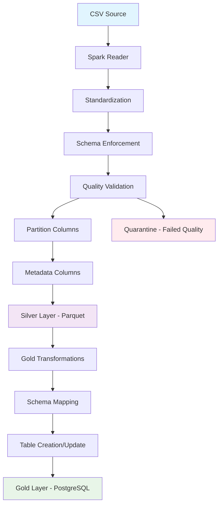
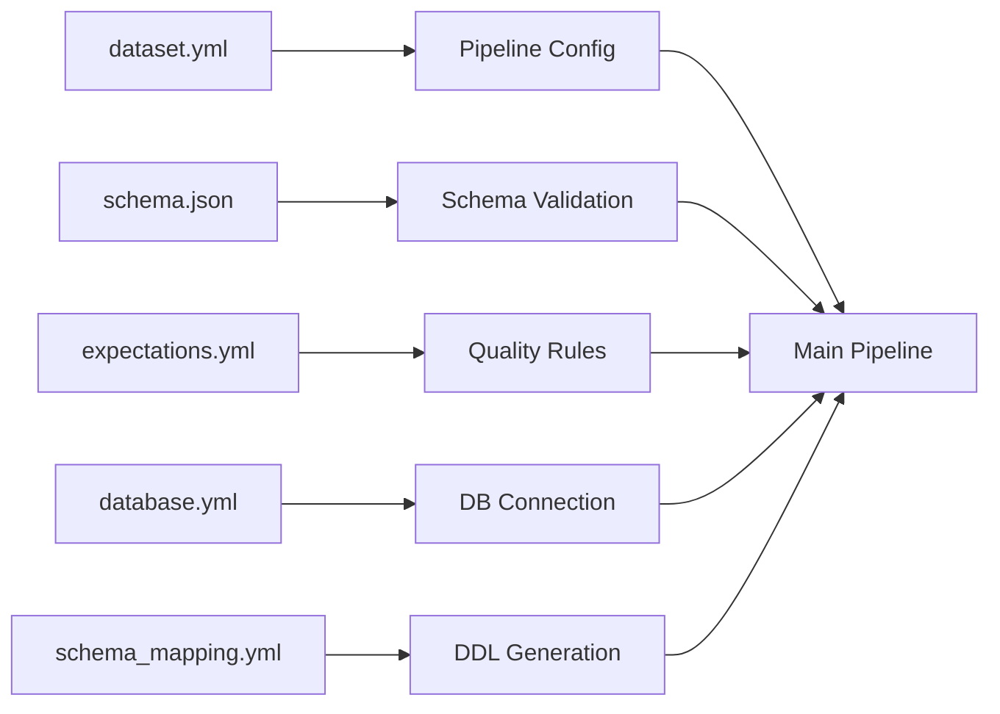
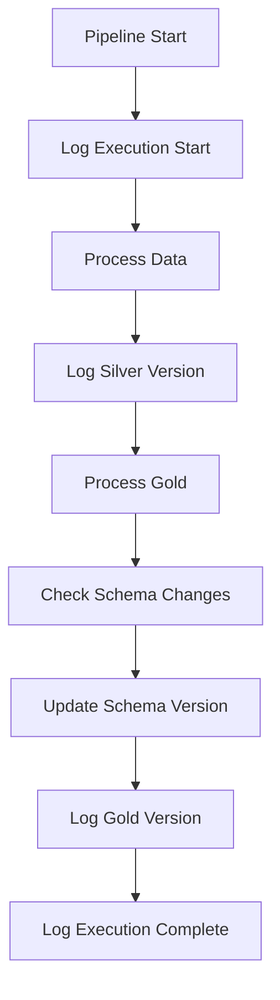

# DOCUMENTACIÓN TÉCNICA DETALLADA DEL CÓDIGO
## MVP Config-Driven Data Pipeline

### ÍNDICE
1. [Módulo Principal: spark_job_with_db.py](#módulo-principal-spark_job_with_dbpy)
2. [Módulo de Utilidades: common.py](#módulo-de-utilidades-commonpy)
3. [Módulo de Gestión de Base de Datos: db_manager.py](#módulo-de-gestión-de-base-de-datos-db_managerpy)
4. [Módulo de Mapeo de Esquemas: schema_mapper.py](#módulo-de-mapeo-de-esquemas-schema_mapperpy)
5. [Pipeline Base: spark_job.py](#pipeline-base-spark_jobpy)
6. [Flujos de Datos Completos](#flujos-de-datos-completos)

---

## MÓDULO PRINCIPAL: spark_job_with_db.py

### Propósito General
Pipeline principal que extiende las capacidades básicas de Spark con integración completa a PostgreSQL, soportando creación dinámica de tablas desde esquemas JSON y flujo completo Source → Silver → Gold.

### Importaciones y Dependencias
```python
import sys, os, yaml, json
from datetime import datetime
from pyspark.sql import SparkSession, functions as F
from pyspark.sql.window import Window

# Import database modules
from database.db_manager import DatabaseManager, create_database_manager_from_file
from database.schema_mapper import DatabaseEngine

# Importar funciones comunes
from common import norm_type, parse_order, safe_cast, maybe_config_s3a
```

**Análisis de Dependencias:**
- **sys, os**: Manejo de argumentos de línea de comandos y variables de entorno
- **yaml, json**: Procesamiento de archivos de configuración y esquemas
- **datetime**: Generación de timestamps para versionado y metadata
- **pyspark.sql**: Motor principal de procesamiento distribuido
- **database modules**: Módulos personalizados para gestión de BD y mapeo de esquemas
- **common**: Utilidades compartidas para normalización y configuración

### Funciones Principales

#### 1. load_json_schema(schema_path: str) → dict
```python
def load_json_schema(schema_path: str):
    """Cargar esquema JSON desde archivo"""
    with open(schema_path, 'r', encoding='utf-8') as f:
        return json.load(f)
```

**Propósito:** Carga y parsea archivos de esquema JSON para validación de datos.
**Parámetros de Entrada:**
- `schema_path`: Ruta absoluta o relativa al archivo schema.json
**Salida:** Diccionario Python con la estructura del esquema JSON
**Condiciones Lógicas:** Manejo de errores de archivo no encontrado o JSON malformado

#### 2. enforce_schema(df, json_schema, mode='strict') → DataFrame
```python
def enforce_schema(df, json_schema, mode='strict'):
    """Aplicar esquema JSON al DataFrame con diferentes modos de validación"""
```

**Propósito:** Aplica validación y transformación de esquema basada en JSON Schema.
**Parámetros de Entrada:**
- `df`: DataFrame de PySpark a validar
- `json_schema`: Diccionario con esquema JSON cargado
- `mode`: Modo de validación ('strict', 'permissive', 'ignore')

**Lógica de Negocio:**
- **Modo strict**: Rechaza registros que no cumplan el esquema
- **Modo permissive**: Marca registros inválidos pero los conserva
- **Modo ignore**: Aplica transformaciones sin validación estricta

**Salida:** DataFrame transformado según el esquema especificado

#### 3. load_database_config(config_path: str, environment: str) → DatabaseManager
```python
def load_database_config(config_path: str, environment: str):
    """Cargar configuración de base de datos para un entorno específico"""
    return create_database_manager_from_file(config_path, environment)
```

**Propósito:** Factory function para crear instancias de DatabaseManager.
**Parámetros de Entrada:**
- `config_path`: Ruta al archivo database.yml
- `environment`: Entorno objetivo (development, production, default)
**Salida:** Instancia configurada de DatabaseManager
**Manejo de Errores:** Validación de archivo existente y entorno válido

#### 4. create_gold_table_name(dataset_id: str, table_settings: dict) → str
```python
def create_gold_table_name(dataset_id: str, table_settings: dict):
    """Generar nombre de tabla para Gold layer basado en configuración"""
    prefix = table_settings.get("table_prefix", "")
    suffix = table_settings.get("table_suffix", "")
    return f"{prefix}{dataset_id}{suffix}"
```

**Propósito:** Genera nombres de tabla consistentes para el Gold layer.
**Parámetros de Entrada:**
- `dataset_id`: Identificador único del dataset
- `table_settings`: Configuración global de tablas desde database.yml
**Salida:** Nombre de tabla formateado según convenciones
**Reglas de Negocio:** Aplicación de prefijos y sufijos configurables

#### 5. apply_business_rules(df, business_rules: list) → DataFrame
```python
def apply_business_rules(df, business_rules: list):
    """Aplicar reglas de negocio configurables al DataFrame"""
    for rule in business_rules:
        condition = rule.get('condition')
        action = rule.get('action', 'filter')
        
        if condition and action == 'filter':
            df = df.filter(condition)
            print(f"[business_rule] Applied filter: {condition}")
    
    return df
```

**Propósito:** Aplica reglas de negocio dinámicas configuradas en YAML.
**Parámetros de Entrada:**
- `df`: DataFrame a procesar
- `business_rules`: Lista de reglas desde configuración gold
**Lógica de Negocio:**
- **action: 'filter'**: Filtra registros que cumplan la condición
- Extensible para otras acciones (transform, validate, etc.)
**Salida:** DataFrame filtrado según reglas de negocio

#### 6. apply_gold_transformations(df, gold_config: dict, table_settings: dict) → DataFrame
```python
def apply_gold_transformations(df, gold_config: dict, table_settings: dict):
    """Aplica transformaciones dinámicas al DataFrame según configuración"""
```

**Propósito:** Aplica transformaciones específicas del Gold layer.
**Parámetros de Entrada:**
- `df`: DataFrame procesado del Silver layer
- `gold_config`: Configuración específica del dataset para Gold
- `table_settings`: Configuración global de tablas

**Transformaciones Aplicadas:**

1. **Exclusión de Columnas:**
```python
exclude_columns = gold_config.get('exclude_columns', 
                                table_settings.get('default_transformations', {}).get('exclude_columns', []))
if exclude_columns:
    existing_exclude_cols = [col for col in exclude_columns if col in df.columns]
    if existing_exclude_cols:
        df = df.drop(*existing_exclude_cols)
```

2. **Adición de Columnas Dinámicas:**
```python
add_cols = gold_config.get('add_columns', [])
for col_def in add_cols:
    if isinstance(col_def, dict) and 'name' in col_def and 'value' in col_def:
        col_name = col_def['name']
        col_value = col_def['value']
        col_type = col_def.get('type', 'string')
        
        # Handle special functions
        if col_value == "current_timestamp()":
            df = df.withColumn(col_name, F.current_timestamp())
        elif col_value == "current_date()":
            df = df.withColumn(col_name, F.current_date())
        elif col_value.startswith("uuid()"):
            df = df.withColumn(col_name, F.monotonically_increasing_id().cast("string"))
        else:
            df = df.withColumn(col_name, F.lit(col_value).cast(col_type))
```

3. **Aplicación de Reglas de Negocio:**
```python
business_rules = gold_config.get('business_rules', [])
df = apply_business_rules(df, business_rules)
```

**Salida:** DataFrame transformado listo para escritura en Gold layer

#### 7. write_to_gold_database(df, dataset_id: str, schema_path: str, db_manager, table_settings: dict) → bool
```python
def write_to_gold_database(df, dataset_id: str, schema_path: str, db_manager, table_settings: dict):
    """Write DataFrame to Gold database with dynamic table creation"""
```

**Propósito:** Escribe datos al Gold layer con creación dinámica de tablas.
**Parámetros de Entrada:**
- `df`: DataFrame transformado para Gold
- `dataset_id`: Identificador del dataset
- `schema_path`: Ruta al esquema JSON
- `db_manager`: Instancia de DatabaseManager
- `table_settings`: Configuración de tablas

**Flujo de Procesamiento:**

1. **Generación de Nombre de Tabla:**
```python
table_name = create_gold_table_name(dataset_id, table_settings)
schema_version = datetime.now().strftime(table_settings.get("version_format", "%Y%m%d_%H%M%S"))
```

2. **Creación/Actualización de Esquema:**
```python
schema_dict = load_json_schema(schema_path)
success = db_manager.create_table_from_schema(
    table_name=table_name,
    schema_dict=schema_dict,
    schema_version=schema_version
)
```

3. **Filtrado de Columnas:**
```python
json_schema = load_json_schema(schema_path)
expected_columns = list(json_schema['properties'].keys())
available_columns = [col for col in expected_columns if col in df.columns]
filtered_df = df.select(*available_columns)
```

4. **Escritura a Base de Datos:**
```python
db_manager.write_dataframe(
    df=filtered_df,
    table_name=table_name,
    mode="append"
)
```

**Salida:** Boolean indicando éxito/fallo de la operación
**Manejo de Errores:** Captura y logging de errores de BD y esquema

#### 8. main() → None
```python
def main():
    """Main pipeline execution"""
```

**Propósito:** Función principal que orquesta todo el pipeline.
**Flujo de Ejecución:**

1. **Parsing de Argumentos:**
```python
if len(sys.argv) < 3:
    print("Usage: python spark_job_with_db.py <dataset_config> <env_config> [db_config] [environment]")
    sys.exit(1)

cfg_path = sys.argv[1]
env_path = sys.argv[2]
db_config_path = sys.argv[3] if len(sys.argv) > 3 else "config/database.yml"
environment = sys.argv[4] if len(sys.argv) > 4 else "default"
```

2. **Carga de Configuraciones:**
```python
cfg = yaml.safe_load(open(cfg_path, 'r', encoding='utf-8'))
env = yaml.safe_load(open(env_path, 'r', encoding='utf-8'))

# Override environment from gold config if specified
gold_config = cfg.get('output', {}).get('gold', {})
if gold_config.get('environment'):
    environment = gold_config['environment']
```

3. **Inicialización de Base de Datos:**
```python
if os.path.exists(db_config_path):
    db_full_config = yaml.safe_load(open(db_config_path, 'r', encoding='utf-8'))
    db_manager = load_database_config(db_config_path, environment)
    table_settings = db_full_config.get("table_settings", {})
    
    # Log pipeline execution start
    execution_id = db_manager.log_pipeline_execution(
        dataset_name=cfg['id'],
        pipeline_type="etl",
        status="started"
    )
```

4. **Inicialización de Spark:**
```python
spark = (
    SparkSession.builder
    .appName(f"cfg-pipeline::{cfg['id']}")
    .config("spark.sql.session.timeZone", env.get('timezone','UTC'))
    .config("spark.sql.sources.partitionOverwriteMode", "dynamic")
    .getOrCreate()
)
```

5. **Lectura de Datos:**
```python
src = cfg['source']
reader = spark.read.options(**src.get('options', {}))
fmt = src['input_format']
if fmt == 'csv':
    df = reader.csv(src['path'])
elif fmt in ('json', 'jsonl'):
    df = reader.json(src['path'])
elif fmt == 'parquet':
    df = reader.parquet(src['path'])
```

6. **Aplicación de Estandarización:**
```python
std = cfg.get('standardization', {})

# Rename columns
for r in std.get('rename', []) or []:
    if r['from'] in df.columns:
        df = df.withColumnRenamed(r['from'], r['to'])

# Enforce schema
if 'schema' in cfg and cfg['schema'].get('ref'):
    jsch = load_json_schema(cfg['schema']['ref'])
    mode = cfg['schema'].get('mode','strict').lower()
    df = enforce_schema(df, jsch, mode=mode)

# Apply casts
for c in std.get('casts', []) or []:
    df = safe_cast(df, c['column'], c['to'], fmt=c.get('format_hint'), on_error=c.get('on_error','fail'))

# Apply defaults
for d in std.get('defaults', []) or []:
    col, val = d['column'], d['value']
    df = df.withColumn(col, F.when(F.col(col).isNull(), F.lit(val)).otherwise(F.col(col)))

# Deduplicate
if 'deduplicate' in std:
    key = std['deduplicate']['key']
    order = parse_order(std['deduplicate'].get('order_by', []))
    w = Window.partitionBy(*key).orderBy(*order) if order else Window.partitionBy(*key)
    df = df.withColumn("_rn", F.row_number().over(w)).filter(F.col("_rn")==1).drop("_rn")
```

7. **Adición de Columnas de Partición y Metadata:**
```python
# Partition columns
parts = out.get('partition_by', [])
if parts:
    base_col_name = out.get('partition_from')
    if base_col_name and base_col_name in df.columns:
        base_col = F.col(base_col_name)
        for p in parts:
            if p not in df.columns:
                if p == 'year':
                    df = df.withColumn(p, F.year(base_col))
                elif p == 'month':
                    df = df.withColumn(p, F.month(base_col))

# Metadata columns
df = df.withColumn("_run_id", F.lit(f"run_{datetime.now().strftime('%Y%m%d_%H%M%S')}"))
df = df.withColumn("_ingestion_ts", F.current_timestamp())
```

8. **Validación de Calidad:**
```python
if 'quality' in cfg and cfg['quality'].get('expectations_ref'):
    expectations_path = cfg['quality']['expectations_ref']
    quarantine_path = cfg['quality'].get('quarantine')
    
    # Load and apply quality rules
    expectations = yaml.safe_load(open(expectations_path, 'r', encoding='utf-8'))
    
    for rule in expectations.get('rules', []):
        rule_name = rule['name']
        expr = rule['expr']
        action = rule.get('on_fail', 'warn')
        
        if action == 'quarantine':
            bad_df = df.filter(f"NOT ({expr})")
            if bad_df.count() > 0 and quarantine_path:
                bad_df.write.mode('append').parquet(f"{quarantine_path}/{rule_name}/")
            df = df.filter(expr)
        elif action == 'drop':
            df = df.filter(expr)
```

9. **Escritura a Silver Layer:**
```python
writer = (
    df.write
    .format(out.get('format','parquet'))
    .option('mergeSchema', str(out.get('merge_schema', True)).lower())
)

if parts:
    writer = writer.partitionBy(*parts)

mode_cfg = (out.get('mode','append') or 'append').lower()
if mode_cfg == 'overwrite_dynamic':
    writer.mode('overwrite').save(out['path'])
else:
    writer.mode('append').save(out['path'])
```

10. **Procesamiento Gold Layer:**
```python
gold_config = cfg.get('output', {}).get('gold', {})

if gold_config.get('enabled', False) and db_manager and 'schema' in cfg:
    schema_path = cfg['schema']['ref']
    dataset_id = cfg['id']
    
    # Apply transformations
    gold_df = apply_gold_transformations(df, gold_config, table_settings)
    
    # Write to database
    success = write_to_gold_database(
        df=gold_df,
        dataset_id=dataset_id,
        schema_path=schema_path,
        db_manager=db_manager,
        table_settings=table_settings
    )
```

11. **Logging y Finalización:**
```python
# Log completion
if db_manager and execution_id:
    db_manager.log_pipeline_execution(
        dataset_name=cfg['id'],
        pipeline_type="etl",
        status="completed",
        execution_id=execution_id
    )

print("[pipeline] Pipeline completado exitosamente")
```

---

## MÓDULO DE UTILIDADES: common.py

### Propósito General
Módulo de utilidades compartidas que proporciona funciones comunes para normalización de tipos de datos, parsing de expresiones de ordenamiento, casting seguro con manejo de errores y configuración de S3A para Spark.

### Funciones Principales

#### 1. norm_type(type_str: str) → str
```python
def norm_type(type_str: str):
    """Normalizar tipos de datos a tipos de PySpark"""
    type_str = type_str.strip().lower()
    
    # Handle decimal types with precision and scale
    decimal_full_match = DECIMAL_FULL.match(type_str)
    if decimal_full_match:
        precision, scale = decimal_full_match.groups()
        return f"DecimalType({precision}, {scale})"
    
    decimal_prec_match = DECIMAL_PREC.match(type_str)
    if decimal_prec_match:
        precision = decimal_prec_match.group(1)
        return f"DecimalType({precision}, 0)"
    
    # Use aliases for common types
    return ALIASES.get(type_str, f"StringType()  # Unknown: {type_str}")
```

**Propósito:** Convierte strings de tipos de datos a tipos válidos de PySpark.
**Parámetros de Entrada:**
- `type_str`: String representando el tipo de dato (ej: "decimal(18,2)", "string", "int")
**Lógica de Procesamiento:**
- Maneja tipos decimales con precisión y escala
- Utiliza diccionario de aliases para tipos comunes
- Retorna StringType por defecto para tipos desconocidos
**Salida:** String con tipo de PySpark válido

#### 2. parse_order(order_list: List[str]) → List
```python
def parse_order(order_list: List[str]):
    """Parse order expressions for sorting"""
    result = []
    for expr in order_list:
        if expr.lower().endswith(' desc'):
            col_name = expr[:-5].strip()
            result.append(col(col_name).desc())
        elif expr.lower().endswith(' asc'):
            col_name = expr[:-4].strip()
            result.append(col(col_name).asc())
        else:
            result.append(col(expr.strip()))
    return result
```

**Propósito:** Convierte expresiones de ordenamiento en objetos Column de PySpark.
**Parámetros de Entrada:**
- `order_list`: Lista de strings con expresiones de orden (ej: ["payment_date desc", "amount asc"])
**Lógica de Procesamiento:**
- Detecta sufijos 'desc' y 'asc'
- Crea objetos Column con ordenamiento apropiado
- Orden ascendente por defecto
**Salida:** Lista de objetos Column de PySpark

#### 3. safe_cast(df: DataFrame, column: str, to_type: str, fmt: str = None, on_error: str = 'fail') → DataFrame
```python
def safe_cast(df: DataFrame, column: str, to_type: str, fmt: str = None, on_error: str = 'fail'):
    """Safe type casting with error handling"""
    if column not in df.columns:
        print(f"Warning: Column '{column}' not found in DataFrame")
        return df
    
    try:
        spark_type = norm_type(to_type)
        
        if to_type.lower() in ['timestamp', 'date'] and fmt:
            # Use format hint for date/timestamp parsing
            if to_type.lower() == 'timestamp':
                df = df.withColumn(column, F.to_timestamp(F.col(column), fmt))
            else:
                df = df.withColumn(column, F.to_date(F.col(column), fmt))
        else:
            # Regular casting
            df = df.withColumn(column, F.col(column).cast(eval(spark_type)))
        
        return df
        
    except Exception as e:
        if on_error == 'fail':
            raise e
        elif on_error == 'null':
            df = df.withColumn(column, F.lit(None))
        elif on_error == 'skip':
            print(f"Skipping cast for column '{column}': {e}")
        
        return df
```

**Propósito:** Realiza casting de tipos con manejo robusto de errores.
**Parámetros de Entrada:**
- `df`: DataFrame a procesar
- `column`: Nombre de la columna a convertir
- `to_type`: Tipo de destino
- `fmt`: Formato para fechas/timestamps (opcional)
- `on_error`: Estrategia de manejo de errores ('fail', 'null', 'skip')

**Lógica de Procesamiento:**
- Valida existencia de columna
- Maneja formatos especiales para fechas/timestamps
- Aplica estrategias de error configurables
**Salida:** DataFrame con columna convertida

#### 4. maybe_config_s3a(spark: SparkSession, path: str, env: dict) → None
```python
def maybe_config_s3a(spark: SparkSession, path: str, env: dict):
    """Configure S3A settings if path uses s3a:// protocol"""
    if not path.startswith('s3a://'):
        return
    
    s3_config = env.get('s3', {})
    if not s3_config:
        return
    
    # Configure S3A settings
    spark.conf.set("spark.hadoop.fs.s3a.endpoint", s3_config.get('endpoint', ''))
    spark.conf.set("spark.hadoop.fs.s3a.access.key", s3_config.get('access_key', ''))
    spark.conf.set("spark.hadoop.fs.s3a.secret.key", s3_config.get('secret_key', ''))
    spark.conf.set("spark.hadoop.fs.s3a.path.style.access", "true")
    spark.conf.set("spark.hadoop.fs.s3a.impl", "org.apache.hadoop.fs.s3a.S3AFileSystem")
```

**Propósito:** Configura automáticamente S3A cuando se detectan rutas s3a://.
**Parámetros de Entrada:**
- `spark`: Sesión de Spark a configurar
- `path`: Ruta a verificar
- `env`: Configuración de entorno con credenciales S3
**Lógica de Procesamiento:**
- Detecta protocolo s3a://
- Configura credenciales y endpoint
- Establece configuraciones de Hadoop para S3A
**Salida:** None (modifica configuración de Spark)

---

## MÓDULO DE GESTIÓN DE BASE DE DATOS: db_manager.py

### Propósito General
Módulo especializado en gestión de conexiones a base de datos PostgreSQL, creación dinámica de tablas desde esquemas JSON, versionado de esquemas y logging de metadata del pipeline.

### Clases Principales

#### 1. DatabaseConfig
```python
@dataclass
class DatabaseConfig:
    """Configuración de conexión a base de datos"""
    engine_type: DatabaseEngine
    host: str
    port: int
    database: str
    username: str
    password: str
    schema: str = "public"
    pool_size: int = 10
    max_overflow: int = 20
    pool_timeout: int = 30
    pool_recycle: int = 3600
```

**Propósito:** Dataclass que encapsula toda la configuración de conexión a BD.
**Atributos:**
- `engine_type`: Tipo de motor de BD (PostgreSQL)
- `host, port, database`: Parámetros de conexión
- `username, password`: Credenciales
- `schema`: Esquema por defecto
- `pool_*`: Configuración de pool de conexiones

#### 2. SchemaVersion
```python
@dataclass
class SchemaVersion:
    """Información de versión de esquema"""
    table_name: str
    version: str
    schema_hash: str
    created_at: datetime
    schema_content: str
```

**Propósito:** Dataclass para tracking de versiones de esquema.
**Atributos:**
- `table_name`: Nombre de la tabla
- `version`: Versión del esquema (timestamp)
- `schema_hash`: Hash MD5 del contenido del esquema
- `created_at`: Timestamp de creación
- `schema_content`: Contenido completo del esquema JSON

#### 3. DatabaseManager
```python
class DatabaseManager:
    """Gestor principal de base de datos con soporte para esquemas dinámicos"""
    
    def __init__(self, config: DatabaseConfig):
        self.config = config
        self.engine = None
        self.connection = None
        self.schema_mapper = SchemaMapper()
```

**Propósito:** Clase principal que gestiona todas las operaciones de BD.

##### Métodos Principales:

**a) _generate_connection_string() → str**
```python
def _generate_connection_string(self):
    """Generar string de conexión para PostgreSQL"""
    return (f"postgresql://{self.config.username}:{self.config.password}@"
            f"{self.config.host}:{self.config.port}/{self.config.database}")
```

**b) connect() → bool**
```python
def connect(self):
    """Establecer conexión a la base de datos"""
    try:
        connection_string = self._generate_connection_string()
        self.engine = create_engine(
            connection_string,
            pool_size=self.config.pool_size,
            max_overflow=self.config.max_overflow,
            pool_timeout=self.config.pool_timeout,
            pool_recycle=self.config.pool_recycle
        )
        
        # Test connection
        with self.engine.connect() as conn:
            conn.execute(text("SELECT 1"))
        
        self._ensure_schema_versions_table()
        self._ensure_default_schemas()
        
        return True
    except Exception as e:
        print(f"Error connecting to database: {e}")
        return False
```

**c) create_table_from_schema(table_name: str, schema_dict: dict, schema_version: str) → bool**
```python
def create_table_from_schema(self, table_name: str, schema_dict: dict = None, 
                           schema_path: str = None, schema_version: str = None):
    """Crear tabla desde esquema JSON con versionado"""
    
    # Load schema if path provided
    if schema_path and not schema_dict:
        schema_dict = load_json_schema(schema_path)
    
    if not schema_dict:
        raise ValueError("Must provide either schema_dict or schema_path")
    
    # Generate schema hash for versioning
    schema_content = json.dumps(schema_dict, sort_keys=True)
    schema_hash = hashlib.md5(schema_content.encode()).hexdigest()
    
    # Check if schema has changed
    if self._schema_exists(table_name, schema_hash):
        print(f"Schema for table '{table_name}' is up to date")
        return True
    
    try:
        # Generate DDL
        ddl = self.schema_mapper.json_schema_dict_to_ddl(schema_dict, table_name)
        
        # Execute DDL
        with self.engine.connect() as conn:
            conn.execute(text(ddl))
            conn.commit()
        
        # Record schema version
        self._record_schema_version(table_name, schema_version or "auto", 
                                  schema_hash, schema_content)
        
        print(f"Table '{table_name}' created/updated successfully")
        return True
        
    except Exception as e:
        print(f"Error creating table '{table_name}': {e}")
        return False
```

**d) write_dataframe(df: DataFrame, table_name: str, mode: str = "append") → bool**
```python
def write_dataframe(self, df: DataFrame, table_name: str, mode: str = "append"):
    """Escribir DataFrame de Spark a la base de datos usando JDBC"""
    try:
        connection_properties = self._get_spark_connection_properties()
        
        df.write \
          .format("jdbc") \
          .option("url", self._generate_connection_string()) \
          .option("dbtable", table_name) \
          .option("user", self.config.username) \
          .option("password", self.config.password) \
          .option("driver", "org.postgresql.Driver") \
          .mode(mode) \
          .save()
        
        print(f"DataFrame written to table '{table_name}' successfully")
        return True
        
    except Exception as e:
        print(f"Error writing DataFrame to table '{table_name}': {e}")
        return False
```

**e) log_pipeline_execution(dataset_name: str, pipeline_type: str, status: str, ...) → str**
```python
def log_pipeline_execution(self, dataset_name: str, pipeline_type: str = "etl", 
                         status: str = "started", error_message: str = None,
                         execution_id: str = None) -> str:
    """Registrar ejecución del pipeline en metadata.pipeline_executions"""
    
    pipeline_executions_table = self.schema_mapper.get_metadata_table_name("pipeline_executions")
    
    if execution_id is None:
        execution_id = f"{dataset_name}_{datetime.utcnow().strftime('%Y%m%d_%H%M%S_%f')}"
    
    if status == "started":
        query = f"""
        INSERT INTO {pipeline_executions_table} 
        (execution_id, dataset_name, pipeline_type, status, started_at)
        VALUES (:execution_id, :dataset_name, :pipeline_type, :status, :started_at)
        """
        params = {
            "execution_id": execution_id,
            "dataset_name": dataset_name,
            "pipeline_type": pipeline_type,
            "status": status,
            "started_at": datetime.utcnow()
        }
    else:
        query = f"""
        UPDATE {pipeline_executions_table} 
        SET status = :status, ended_at = :ended_at, error_message = :error_message
        WHERE execution_id = :execution_id
        """
        params = {
            "status": status,
            "ended_at": datetime.utcnow(),
            "error_message": error_message,
            "execution_id": execution_id
        }
    
    with self.engine.connect() as conn:
        conn.execute(text(query), params)
        conn.commit()
    
    return execution_id
```

**f) log_dataset_version(dataset_name: str, version: str, schema_path: str, record_count: int) → None**
```python
def log_dataset_version(self, dataset_name: str, version: str, 
                       schema_path: str = None, record_count: int = None):
    """Registrar versión de dataset en metadata.dataset_versions"""
    
    dataset_versions_table = self.schema_mapper.get_metadata_table_name("dataset_versions")
    
    query = f"""
    INSERT INTO {dataset_versions_table} 
    (dataset_name, version, schema_path, record_count, created_at)
    VALUES (:dataset_name, :version, :schema_path, :record_count, :created_at)
    """
    
    params = {
        "dataset_name": dataset_name,
        "version": version,
        "schema_path": schema_path,
        "record_count": record_count,
        "created_at": datetime.utcnow()
    }
    
    with self.engine.connect() as conn:
        conn.execute(text(query), params)
        conn.commit()
```

---

## MÓDULO DE MAPEO DE ESQUEMAS: schema_mapper.py

### Propósito General
Módulo especializado en conversión de esquemas JSON a DDL SQL, soportando PostgreSQL con capacidades de extensión para otros motores de BD.

### Clases y Enums

#### 1. DatabaseEngine
```python
class DatabaseEngine(Enum):
    """Motores de base de datos soportados"""
    POSTGRESQL = "postgresql"
```

#### 2. ColumnDefinition
```python
@dataclass
class ColumnDefinition:
    """Definición de columna para DDL"""
    name: str
    sql_type: str
    nullable: bool = True
    primary_key: bool = False
    default_value: str = None
```

#### 3. SchemaMapper
```python
class SchemaMapper:
    """Mapeador de esquemas JSON a DDL SQL"""
    
    def __init__(self, config_path: str = "config/schema_mapping.yml"):
        self.config = self._load_config(config_path)
        self.engine = DatabaseEngine.POSTGRESQL
```

##### Métodos Principales:

**a) _load_config(config_path: str) → dict**
```python
def _load_config(self, config_path: str):
    """Cargar configuración de mapeo desde YAML"""
    try:
        with open(config_path, 'r', encoding='utf-8') as f:
            return yaml.safe_load(f)
    except FileNotFoundError:
        # Return default configuration
        return {
            "type_mappings": {
                "postgresql": {
                    "string": "TEXT",
                    "number": "NUMERIC",
                    "integer": "INTEGER",
                    "boolean": "BOOLEAN",
                    "array": "JSONB",
                    "object": "JSONB",
                    "null": "TEXT"
                }
            }
        }
```

**b) _map_json_type_to_sql(json_type: str, format_hint: str = None) → str**
```python
def _map_json_type_to_sql(self, json_type: str, format_hint: str = None):
    """Mapear tipo JSON a tipo SQL"""
    
    # Handle format hints for more specific types
    if format_hint:
        if format_hint == "date-time":
            return "TIMESTAMP"
        elif format_hint == "date":
            return "DATE"
        elif format_hint == "uuid":
            return "UUID"
        elif format_hint == "email":
            return "VARCHAR(255)"
    
    # Get type mapping from configuration
    type_mappings = self.config.get("type_mappings", {}).get("postgresql", {})
    return type_mappings.get(json_type, "TEXT")
```

**c) _detect_constraints(property_name: str, property_def: dict) → dict**
```python
def _detect_constraints(self, property_name: str, property_def: dict):
    """Detectar restricciones desde definición de propiedad JSON"""
    constraints = {}
    
    # Check for string length constraints
    if property_def.get("type") == "string":
        max_length = property_def.get("maxLength")
        if max_length:
            constraints["max_length"] = max_length
    
    # Check for numeric constraints
    if property_def.get("type") in ["number", "integer"]:
        minimum = property_def.get("minimum")
        maximum = property_def.get("maximum")
        if minimum is not None:
            constraints["minimum"] = minimum
        if maximum is not None:
            constraints["maximum"] = maximum
    
    # Check for enum constraints
    enum_values = property_def.get("enum")
    if enum_values:
        constraints["enum"] = enum_values
    
    return constraints
```

**d) _json_schema_to_columns(schema: dict) → List[ColumnDefinition]**
```python
def _json_schema_to_columns(self, schema: dict):
    """Convertir esquema JSON a lista de ColumnDefinition"""
    columns = []
    properties = schema.get("properties", {})
    required_fields = schema.get("required", [])
    
    for prop_name, prop_def in properties.items():
        json_type = prop_def.get("type", "string")
        format_hint = prop_def.get("format")
        
        # Map to SQL type
        sql_type = self._map_json_type_to_sql(json_type, format_hint)
        
        # Handle string length constraints
        if json_type == "string" and "maxLength" in prop_def:
            max_length = prop_def["maxLength"]
            sql_type = f"VARCHAR({max_length})"
        
        # Handle enum constraints
        if "enum" in prop_def:
            enum_values = "', '".join(prop_def["enum"])
            sql_type = f"VARCHAR(50) CHECK ({prop_name} IN ('{enum_values}'))"
        
        # Determine nullability
        nullable = prop_name not in required_fields
        
        # Check for primary key
        primary_key = self._is_primary_key(prop_name, prop_def)
        
        column = ColumnDefinition(
            name=prop_name,
            sql_type=sql_type,
            nullable=nullable,
            primary_key=primary_key
        )
        
        columns.append(column)
    
    return columns
```

**e) _detect_primary_key(schema: dict) → List[str]**
```python
def _detect_primary_key(self, schema: dict):
    """Detectar clave primaria desde configuración o convenciones"""
    
    # Check configuration for primary key detection rules
    pk_config = self.config.get("primary_key_detection", {})
    
    # Check for explicit primary key in schema
    if "primary_key" in schema:
        return schema["primary_key"] if isinstance(schema["primary_key"], list) else [schema["primary_key"]]
    
    # Use naming conventions
    naming_patterns = pk_config.get("naming_patterns", ["id", "*_id"])
    properties = schema.get("properties", {})
    
    for pattern in naming_patterns:
        if pattern == "id" and "id" in properties:
            return ["id"]
        elif pattern.endswith("_id"):
            for prop_name in properties:
                if prop_name.endswith("_id"):
                    return [prop_name]
    
    return []
```

**f) generate_create_table_ddl(schema: dict, table_name: str) → str**
```python
def generate_create_table_ddl(self, schema: dict, table_name: str):
    """Generar DDL CREATE TABLE desde esquema JSON"""
    
    columns = self._json_schema_to_columns(schema)
    primary_keys = self._detect_primary_key(schema)
    
    # Build column definitions
    column_defs = []
    for column in columns:
        col_def = f"{column.name} {column.sql_type}"
        
        if not column.nullable:
            col_def += " NOT NULL"
        
        if column.default_value:
            col_def += f" DEFAULT {column.default_value}"
        
        column_defs.append(col_def)
    
    # Add primary key constraint
    if primary_keys:
        pk_constraint = f"PRIMARY KEY ({', '.join(primary_keys)})"
        column_defs.append(pk_constraint)
    
    # Build complete DDL
    ddl = f"""
    CREATE TABLE IF NOT EXISTS {table_name} (
        {',\n        '.join(column_defs)}
    );
    """
    
    return ddl.strip()
```

**g) generate_alter_table_ddl(old_schema: dict, new_schema: dict, table_name: str) → List[str]**
```python
def generate_alter_table_ddl(self, old_schema: dict, new_schema: dict, table_name: str):
    """Generar DDL ALTER TABLE para cambios de esquema"""
    
    old_columns = {col.name: col for col in self._json_schema_to_columns(old_schema)}
    new_columns = {col.name: col for col in self._json_schema_to_columns(new_schema)}
    
    alter_statements = []
    
    # Add new columns
    for col_name, col_def in new_columns.items():
        if col_name not in old_columns:
            alter_stmt = f"ALTER TABLE {table_name} ADD COLUMN {col_name} {col_def.sql_type}"
            if not col_def.nullable:
                alter_stmt += " NOT NULL"
            alter_statements.append(alter_stmt)
    
    # Modify existing columns (type changes)
    for col_name, new_col in new_columns.items():
        if col_name in old_columns:
            old_col = old_columns[col_name]
            if old_col.sql_type != new_col.sql_type:
                alter_stmt = f"ALTER TABLE {table_name} ALTER COLUMN {col_name} TYPE {new_col.sql_type}"
                alter_statements.append(alter_stmt)
    
    # Note: Column drops are not automatically generated for safety
    
    return alter_statements
```

---

## FLUJOS DE DATOS COMPLETOS

### 1. Flujo Principal: Source → Silver → Gold



### 2. Flujo de Configuración



### 3. Flujo de Metadata y Versionado



### Condiciones Lógicas y Reglas de Negocio

#### 1. Validación de Calidad
- **Quarantine**: Registros que fallan validación se envían a cuarentena
- **Drop**: Registros inválidos se eliminan del flujo
- **Warn**: Se registra advertencia pero se conservan los datos

#### 2. Transformaciones Gold
- **Exclusión de Columnas**: Remueve columnas técnicas (_run_id, _ingestion_ts)
- **Adición de Columnas**: Agrega columnas de negocio con valores dinámicos
- **Reglas de Negocio**: Aplica filtros configurables

#### 3. Versionado de Esquemas
- **Hash-based**: Detecta cambios usando MD5 del esquema JSON
- **Timestamp**: Versiones identificadas por timestamp
- **Backward Compatibility**: Soporte para evolución de esquemas

### Parámetros de Entrada y Salida

#### Entrada del Pipeline:
1. **dataset_config**: Ruta al archivo de configuración del dataset
2. **env_config**: Ruta al archivo de configuración de entorno
3. **db_config**: Ruta al archivo de configuración de BD (opcional)
4. **environment**: Entorno objetivo (development, production, default)

#### Salida del Pipeline:
1. **Silver Layer**: Archivos Parquet particionados en S3/MinIO
2. **Gold Layer**: Tablas en PostgreSQL con esquemas dinámicos
3. **Quarantine**: Datos que fallan validación de calidad
4. **Metadata**: Logs de ejecución y versiones de datasets

### Resultados Esperados

#### Éxito del Pipeline:
- Datos procesados y almacenados en ambas capas
- Metadata registrada correctamente
- Esquemas de BD actualizados según necesidad
- Logs de ejecución completos

#### Manejo de Errores:
- Fallos de conexión a BD registrados pero no bloquean Silver
- Errores de calidad manejados según configuración
- Fallos de esquema registrados con rollback automático
- Logs detallados para debugging y monitoreo