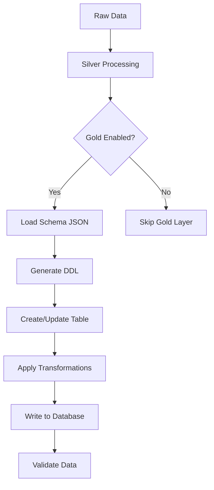

# Gold Layer Database Integration

Esta documentación describe la funcionalidad de integración con bases de datos para el Gold layer, que permite crear automáticamente tablas basadas en los archivos `schema.json` y cargar datos procesados desde Silver.

## 🎯 Características Principales

- **Creación Automática de Tablas**: Las tablas se generan dinámicamente basadas en `schema.json`
- **Soporte PostgreSQL**: Integración optimizada para PostgreSQL
- **Versionado de Esquemas**: Control automático de cambios en el esquema
- **Configuración Flexible**: Configuración por ambiente (desarrollo, producción)
- **Validación Automática**: Verificación de integridad de datos y esquemas

## 📁 Estructura de Archivos

```
mvp-config-driven/
├── pipelines/
│   ├── database/
│   │   ├── __init__.py
│   │   ├── schema_mapper.py      # Mapeo JSON Schema → SQL DDL
│   │   └── db_manager.py         # Gestión de conexiones y operaciones
│   ├── spark_job_with_db.py      # Pipeline extendido con BD
│   └── test_db_integration.py    # Tests de integración
├── config/
│   ├── database.yml              # Configuración de bases de datos
│   └── datasets/finanzas/payments_v1/
│       └── dataset_with_gold.yml # Config extendida con Gold layer
├── scripts/
│   ├── runner_with_db.sh         # Runner con soporte BD
│   └── validate_gold_layer.py    # Validación de Gold layer
└── docs/
    └── GOLD_LAYER_DATABASE.md    # Esta documentación
```

## ⚙️ Configuración

### 1. Configuración de Base de Datos (`config/database.yml`)

```yaml
# Configuración global
default_engine: postgresql
connection_timeout: 30
retry_attempts: 3

# Configuraciones por ambiente
environments:
  development:
    engine: postgresql
    connection:
      host: "localhost"
      port: 5432
      database: "dev_database"
      username: "dev_user"
      password: "dev_pass"
    table_settings:
      table_prefix: "dev_"
      enable_schema_versioning: true
      
  production:
    engine: postgresql
    connection:
      host: "localhost"
      port: 5432
      database: "production_db"
      username: "${DB_USER}"
      password: "${DB_PASSWORD}"
    table_settings:
      table_prefix: "prod_"
      enable_schema_versioning: true
```

### 2. Configuración de Dataset con Gold Layer

```yaml
# En dataset.yml, agregar sección gold:
output:
  silver:
    format: parquet
    path: "s3a://silver/payments_v1/"
    
  gold:
    enabled: true
    database_config: "config/database.yml"
    environment: "development"
    table_name: "payments_v1"
    write_mode: "append"
    schema_versioning: true
    auto_migrate: false
    
    transformations:
      exclude_columns: ["_run_id", "_ingestion_ts"]
      add_columns:
        - { name: "data_source", value: "payments_system", type: "string" }
        - { name: "processed_at", value: "current_timestamp()", type: "timestamp" }
```

## 🚀 Uso

### 1. Ejecución del Pipeline

```bash
# Usando el runner mejorado
./scripts/runner_with_db.sh config/datasets/finanzas/payments_v1/dataset_with_gold.yml

# Con configuración específica
./scripts/runner_with_db.sh \
  config/datasets/finanzas/payments_v1/dataset_with_gold.yml \
  config/env.yml \
  config/database.yml \
  production
```

### 2. Validación Post-Ejecución

```bash
# Validar que los datos se cargaron correctamente
python scripts/validate_gold_layer.py \
  config/datasets/finanzas/payments_v1/dataset_with_gold.yml \
  config/database.yml \
  development
```

### 3. Ejecución de Tests

```bash
# Tests de integración
python pipelines/test_db_integration.py

# Tests específicos
python -m pytest pipelines/test_db_integration.py::test_schema_mapping -v
```

## 🔄 Flujo de Procesamiento



## 📊 Mapeo de Tipos de Datos

### JSON Schema → SQL Types

| JSON Schema Type | PostgreSQL |
|------------------|------------|
| `string` | VARCHAR(255) |
| `integer` | INTEGER |
| `number` | DECIMAL(18,2) |
| `boolean` | BOOLEAN |
| `string` (date-time) | TIMESTAMP |

### Ejemplo de Schema JSON

```json
{
  "type": "object",
  "required": ["payment_id", "customer_id", "amount", "payment_date"],
  "properties": {
    "payment_id": {
      "type": "string",
      "pattern": "^PAY-[0-9]{8}$"
    },
    "customer_id": {
      "type": "string"
    },
    "amount": {
      "type": "number",
      "minimum": 0
    },
    "currency": {
      "type": "string",
      "enum": ["USD", "EUR", "CLP"]
    },
    "payment_date": {
      "type": "string",
      "format": "date-time"
    }
  }
}
```

### DDL Generado (PostgreSQL)

```sql
CREATE TABLE IF NOT EXISTS dev_payments_v1 (
    payment_id VARCHAR(255) NOT NULL,
    customer_id VARCHAR(255) NOT NULL,
    amount DECIMAL(18,2) NOT NULL,
    currency VARCHAR(255),
    payment_date TIMESTAMP NOT NULL,
    data_source VARCHAR(255),
    processed_at TIMESTAMP,
    PRIMARY KEY (payment_id)
);
```

## 🔧 Versionado de Esquemas

### Tabla de Versiones

Cuando `schema_versioning: true`, se crea automáticamente una tabla de versiones:

```sql
CREATE TABLE dev_payments_v1_schema_versions (
    version_id SERIAL PRIMARY KEY,
    schema_hash VARCHAR(64) NOT NULL,
    schema_content TEXT NOT NULL,
    created_at TIMESTAMP DEFAULT CURRENT_TIMESTAMP,
    is_active BOOLEAN DEFAULT TRUE
);
```

### Detección de Cambios

- Se calcula un hash SHA-256 del schema JSON
- Si el hash cambia, se detecta una nueva versión
- Opcionalmente se pueden aplicar migraciones automáticas

## 🛠️ Configuraciones Avanzadas

### Transformaciones de Datos

```yaml
gold:
  transformations:
    # Excluir columnas técnicas
    exclude_columns: ["_run_id", "_ingestion_ts"]
    
    # Agregar columnas de negocio
    add_columns:
      - { name: "data_source", value: "payments_system", type: "string" }
      - { name: "processed_at", value: "current_timestamp()", type: "timestamp" }
    
    # Reglas de negocio
    business_rules:
      - { condition: "amount > 0", action: "filter" }
      - { condition: "currency IS NOT NULL", action: "filter" }
```

### Configuración de Tabla

```yaml
# Table settings are configured globally in database.yml
# No need to override in dataset configuration
gold:
  enabled: true
  database_config: "config/database.yml"
  environment: "development"
```

## 🔍 Troubleshooting

### Problemas Comunes

1. **Error de Conexión a BD**
   ```
   Error: Could not connect to database
   ```
   - Verificar credenciales en `database.yml`
   - Confirmar que la BD esté ejecutándose
   - Revisar configuración de red/firewall

2. **Schema Mismatch**
   ```
   Error: Column 'amount' type mismatch
   ```
   - Ejecutar validación: `python scripts/validate_gold_layer.py`
   - Revisar mapeo de tipos en `schema_mapper.py`
   - Considerar migración manual si es necesario

3. **Tabla No Existe**
   ```
   Error: Table 'payments_v1' does not exist
   ```
   - Verificar que `gold.enabled: true`
   - Confirmar permisos de creación de tablas
   - Revisar logs de ejecución del pipeline

### Logs y Debugging

```bash
# Ejecutar con logs detallados
export SPARK_LOG_LEVEL=DEBUG
./scripts/runner_with_db.sh config/datasets/.../dataset_with_gold.yml

# Validación con output verbose
python scripts/validate_gold_layer.py \
  config/datasets/.../dataset_with_gold.yml \
  config/database.yml \
  development \
  --verbose
```

## 📈 Monitoreo y Métricas

### Métricas Recomendadas

- **Tiempo de Ejecución**: Duración del pipeline Silver → Gold
- **Volumen de Datos**: Número de registros procesados
- **Errores de Schema**: Fallos en validación de esquema
- **Disponibilidad de BD**: Uptime de la base de datos

### Queries de Monitoreo

```sql
-- Verificar última carga
SELECT MAX(processed_at) as last_load 
FROM dev_payments_v1;

-- Contar registros por día
SELECT DATE(payment_date) as date, COUNT(*) as records
FROM dev_payments_v1 
GROUP BY DATE(payment_date) 
ORDER BY date DESC;

-- Verificar versiones de schema
SELECT version_id, schema_hash, created_at, is_active
FROM dev_payments_v1_schema_versions 
ORDER BY created_at DESC;
```

## 🔮 Próximos Pasos

1. **Soporte para Más BD**: Agregar Oracle, Redshift, BigQuery
2. **Migraciones Automáticas**: Implementar ALTER TABLE automático
3. **Particionado Inteligente**: Particionado automático basado en datos
4. **Métricas Integradas**: Dashboard de monitoreo en tiempo real
5. **Backup Automático**: Respaldo automático antes de migraciones

## 📞 Soporte

Para preguntas o problemas:
1. Revisar esta documentación
2. Ejecutar tests de integración
3. Consultar logs de Spark y base de datos
4. Contactar al equipo de Data Engineering