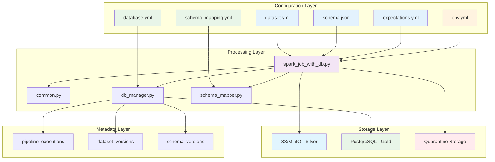
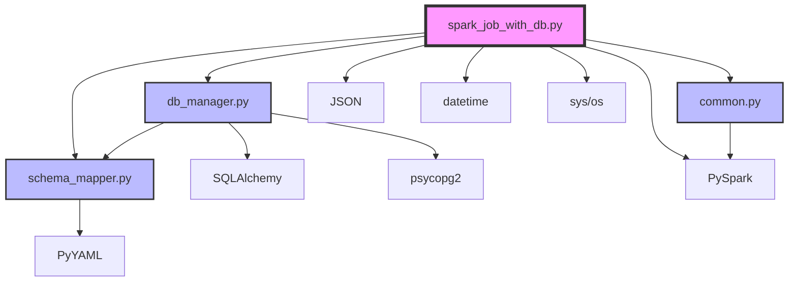
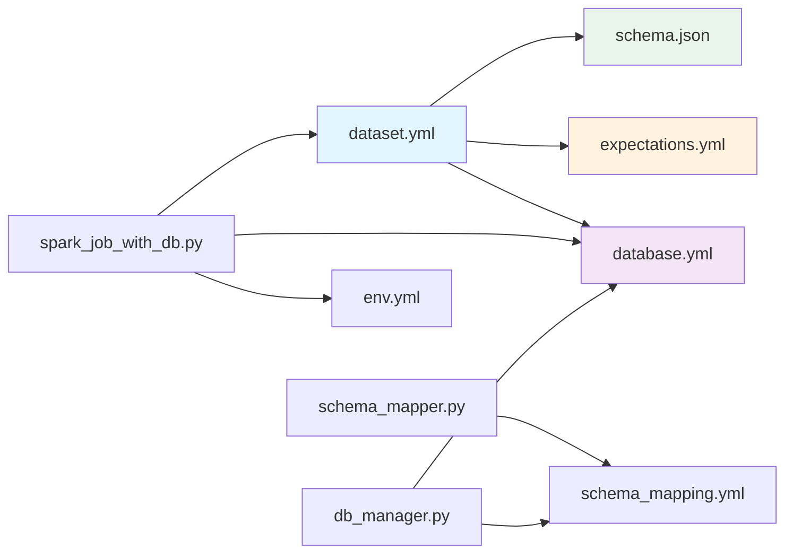
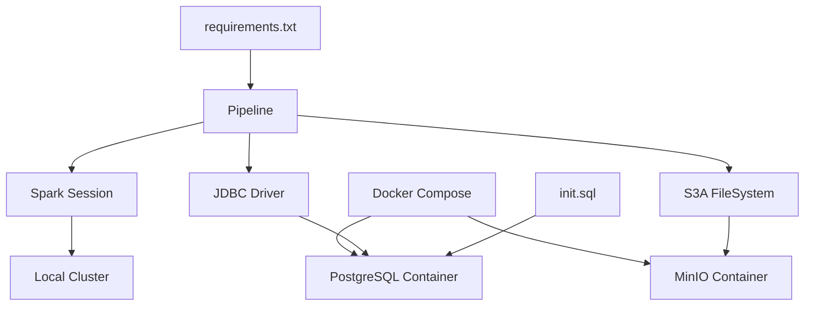

# INTEGRACIÓN DEL SISTEMA
## MVP Config-Driven Data Pipeline

### ÍNDICE
1. [Arquitectura de Integración](#arquitectura-de-integración)
2. [Interacciones entre Componentes](#interacciones-entre-componentes)
3. [Configuraciones YAML Detalladas](#configuraciones-yaml-detalladas)
4. [Mapa de Dependencias](#mapa-de-dependencias)
5. [Flujos de Comunicación](#flujos-de-comunicación)
6. [Gestión de Estado y Transacciones](#gestión-de-estado-y-transacciones)

---

## ARQUITECTURA DE INTEGRACIÓN

### Diagrama de Componentes del Sistema



### Capas de Abstracción

#### 1. Capa de Configuración (Configuration Layer)
- **Propósito**: Externalización completa de la lógica de negocio
- **Componentes**: Archivos YAML y JSON que definen comportamiento
- **Beneficios**: Modificación sin cambios de código, versionado independiente

#### 2. Capa de Procesamiento (Processing Layer)
- **Propósito**: Lógica de transformación y orquestación
- **Componentes**: Módulos Python especializados
- **Beneficios**: Reutilización, mantenibilidad, testing independiente

#### 3. Capa de Almacenamiento (Storage Layer)
- **Propósito**: Persistencia de datos en diferentes formatos
- **Componentes**: S3/MinIO para Silver, PostgreSQL para Gold
- **Beneficios**: Escalabilidad, performance optimizada por uso

#### 4. Capa de Metadata (Metadata Layer)
- **Propósito**: Tracking, auditoría y versionado
- **Componentes**: Tablas especializadas en PostgreSQL
- **Beneficios**: Trazabilidad completa, debugging, compliance

---

## INTERACCIONES ENTRE COMPONENTES

### 1. Inicialización del Pipeline

```python
# Secuencia de inicialización
def pipeline_initialization():
    """
    1. Parsing de argumentos de línea de comandos
    2. Carga de configuraciones YAML
    3. Resolución de dependencias
    4. Inicialización de componentes
    """
    
    # 1. Argumentos
    cfg_path = sys.argv[1]      # dataset.yml
    env_path = sys.argv[2]      # env.yml  
    db_config_path = sys.argv[3] # database.yml
    environment = sys.argv[4]    # development/production
    
    # 2. Carga de configuraciones
    cfg = yaml.safe_load(open(cfg_path, 'r', encoding='utf-8'))
    env = yaml.safe_load(open(env_path, 'r', encoding='utf-8'))
    
    # 3. Override de entorno desde configuración Gold
    gold_config = cfg.get('output', {}).get('gold', {})
    if gold_config.get('environment'):
        environment = gold_config['environment']
    
    # 4. Inicialización de DatabaseManager
    if os.path.exists(db_config_path):
        db_manager = load_database_config(db_config_path, environment)
        table_settings = yaml.safe_load(open(db_config_path))["table_settings"]
    
    # 5. Inicialización de Spark
    spark = SparkSession.builder.appName(f"cfg-pipeline::{cfg['id']}").getOrCreate()
```

### 2. Flujo de Configuración Dinámica

```python
# Resolución de configuraciones en cascada
def configuration_resolution():
    """
    Orden de precedencia para configuraciones:
    1. Configuración específica del dataset
    2. Configuración de entorno
    3. Configuración global
    4. Valores por defecto
    """
    
    # Ejemplo: Resolución de exclude_columns
    exclude_columns = (
        gold_config.get('exclude_columns') or           # Dataset específico
        table_settings.get('default_transformations', {}).get('exclude_columns') or  # Global
        []                                              # Default
    )
    
    # Ejemplo: Resolución de environment
    environment = (
        gold_config.get('environment') or               # Dataset override
        sys.argv[4] if len(sys.argv) > 4 else          # CLI argument
        "default"                                       # Default
    )
```

### 3. Comunicación entre Módulos

#### A. spark_job_with_db.py ↔ db_manager.py

```python
# Patrón de comunicación: Dependency Injection
class PipelineOrchestrator:
    def __init__(self, db_manager: DatabaseManager):
        self.db_manager = db_manager
    
    def process_gold_layer(self, df, dataset_id, schema_path):
        """
        1. Transformaciones aplicadas por spark_job_with_db.py
        2. Delegación a db_manager para operaciones de BD
        3. Retorno de status para logging
        """
        
        # 1. Transformaciones locales
        gold_df = apply_gold_transformations(df, gold_config, table_settings)
        
        # 2. Delegación a DatabaseManager
        success = self.db_manager.create_table_from_schema(
            table_name=create_gold_table_name(dataset_id, table_settings),
            schema_dict=load_json_schema(schema_path),
            schema_version=datetime.now().strftime("%Y%m%d_%H%M%S")
        )
        
        if success:
            success = self.db_manager.write_dataframe(
                df=gold_df,
                table_name=table_name,
                mode="append"
            )
        
        # 3. Logging de resultado
        return success
```

#### B. db_manager.py ↔ schema_mapper.py

```python
# Patrón de comunicación: Composition
class DatabaseManager:
    def __init__(self, config: DatabaseConfig):
        self.config = config
        self.schema_mapper = SchemaMapper()  # Composición
    
    def create_table_from_schema(self, table_name, schema_dict, schema_version):
        """
        1. DatabaseManager coordina la operación
        2. SchemaMapper genera el DDL
        3. DatabaseManager ejecuta el DDL
        """
        
        # 1. Validación y preparación
        schema_content = json.dumps(schema_dict, sort_keys=True)
        schema_hash = hashlib.md5(schema_content.encode()).hexdigest()
        
        # 2. Delegación a SchemaMapper
        ddl = self.schema_mapper.json_schema_dict_to_ddl(schema_dict, table_name)
        
        # 3. Ejecución local
        with self.engine.connect() as conn:
            conn.execute(text(ddl))
            conn.commit()
        
        # 4. Registro de metadata
        self._record_schema_version(table_name, schema_version, schema_hash, schema_content)
```

#### C. common.py → Todos los módulos

```python
# Patrón de comunicación: Utility Functions
# common.py proporciona funciones puras sin estado

# Uso en spark_job_with_db.py
for c in std.get('casts', []):
    df = safe_cast(df, c['column'], c['to'], 
                   fmt=c.get('format_hint'), 
                   on_error=c.get('on_error','fail'))

# Uso en schema_mapper.py
def _map_json_type_to_sql(self, json_type: str, format_hint: str = None):
    # Utiliza norm_type de common.py para consistencia
    normalized_type = norm_type(json_type)
    return self._convert_to_sql_type(normalized_type)
```

---

## CONFIGURACIONES YAML DETALLADAS

### 1. dataset.yml - Configuración Principal del Pipeline

```yaml
# Identificación del dataset
id: payments_v1                    # Identificador único
domain: finanzas                   # Dominio de negocio (opcional)

# Configuración de origen
source:
  input_format: csv                # csv, json, jsonl, parquet
  path: "s3a://raw/payments/2025/09/26/*.csv"
  options:                         # Opciones específicas del formato
    header: "true"
    inferSchema: "true"
    delimiter: ","
    encoding: "UTF-8"

# Estandarización de datos
standardization:
  timezone: America/Bogota         # Zona horaria para timestamps
  
  # Renombrado de columnas
  rename:
    - { from: customerId, to: customer_id }
    - { from: paymentId, to: payment_id }
  
  # Conversión de tipos
  casts:
    - { column: amount, to: "decimal(18,2)", on_error: null }
    - { column: payment_date, to: "timestamp", 
        format_hint: "yyyy-MM-dd[ HH:mm:ss]" }
    - { column: updated_at, to: "timestamp", 
        format_hint: "yyyy-MM-dd[ HH:mm:ss]" }
  
  # Valores por defecto
  defaults:
    - { column: currency, value: "CLP" }
    - { column: status, value: "pending" }
  
  # Deduplicación
  deduplicate:
    key: [payment_id]              # Columnas para identificar duplicados
    order_by: [updated_at desc]    # Criterio de ordenamiento

# Validación de calidad
quality:
  expectations_ref: config/datasets/finanzas/payments_v1/expectations.yml
  quarantine: s3a://raw/quarantine/payments_v1/

# Esquema de validación
schema:
  ref: config/datasets/finanzas/payments_v1/schema.json
  mode: strict                     # strict, permissive, ignore

# Configuración de salida
output:
  # Capa Silver (Parquet)
  silver:
    format: parquet
    path: "s3a://silver/payments_v1/"
    partition_by: [year, month]    # Columnas de particionado
    partition_from: payment_date   # Columna base para generar particiones
    merge_schema: true
    mode: overwrite_dynamic        # append, overwrite, overwrite_dynamic
  
  # Capa Gold (Base de datos)
  gold:
    enabled: true                  # Habilitar procesamiento Gold
    database_config: "config/database.yml"
    environment: "development"     # Override de entorno
    
    # Transformaciones específicas para Gold
    exclude_columns: ["_run_id", "_ingestion_ts"]
    
    # Columnas adicionales (futuro)
    add_columns:
      - { name: "data_source", value: "payments_system", type: "string" }
      - { name: "processed_at", value: "current_timestamp()", type: "timestamp" }
    
    # Reglas de negocio
    business_rules:
      - { condition: "amount > 0", action: "filter" }
      - { condition: "currency IS NOT NULL", action: "filter" }
```

### 2. database.yml - Configuración de Base de Datos

```yaml
# Configuración por entornos
default:
  engine: postgresql
  host: localhost
  port: 5432
  database: data_warehouse
  username: postgres
  password: postgres123
  schema: gold
  
  # Pool de conexiones
  pool_size: 10
  max_overflow: 20
  pool_timeout: 30
  pool_recycle: 3600

development:
  engine: postgresql
  host: postgres                   # Nombre del servicio Docker
  port: 5432
  database: data_warehouse
  username: postgres
  password: postgres123
  schema: gold
  
  pool_size: 5
  max_overflow: 10

production:
  engine: postgresql
  host: ${DB_HOST}                 # Variables de entorno
  port: ${DB_PORT}
  database: ${DB_NAME}
  username: ${DB_USER}
  password: ${DB_PASSWORD}
  schema: ${DB_SCHEMA}
  
  pool_size: 20
  max_overflow: 40

# Configuraciones globales
settings:
  create_tables_if_not_exists: true
  enable_ssl: false
  connection_timeout: 30

# Configuración de tablas
table_settings:
  table_prefix: ""                 # Prefijo para nombres de tabla
  table_suffix: ""                 # Sufijo para nombres de tabla
  version_format: "%Y%m%d_%H%M%S"  # Formato de versión de esquema
  
  # Transformaciones por defecto
  default_transformations:
    exclude_columns: ["_run_id", "_ingestion_ts", "year", "month"]
    add_audit_columns: true
```

### 3. schema_mapping.yml - Configuración de Mapeo de Esquemas

```yaml
# Mapeo de tipos JSON a SQL
type_mappings:
  postgresql:
    string: "TEXT"
    number: "NUMERIC"
    integer: "INTEGER"
    boolean: "BOOLEAN"
    array: "JSONB"
    object: "JSONB"
    null: "TEXT"

# Mapeo de formatos específicos
format_mappings:
  postgresql:
    date-time: "TIMESTAMP"
    date: "DATE"
    uuid: "UUID"
    email: "VARCHAR(255)"
    uri: "TEXT"

# Configuración de restricciones
constraints:
  string_length_limit: 255         # Límite por defecto para VARCHAR
  numeric_precision: 18            # Precisión por defecto para NUMERIC
  numeric_scale: 2                 # Escala por defecto para NUMERIC

# Detección de claves primarias
primary_key_detection:
  naming_patterns: ["id", "*_id"]  # Patrones para detectar PKs
  auto_detect: true                # Detección automática habilitada

# Configuración de validación
validation:
  validate_json_schema: true       # Validar esquemas JSON
  valid_json_types: ["string", "number", "integer", "boolean", "array", "object", "null"]
  supported_engines: ["postgresql"]

# Nombres de tablas de metadata
metadata_tables:
  schema_versions: "schema_versions"
  pipeline_executions: "metadata.pipeline_executions"
  dataset_versions: "metadata.dataset_versions"

# Esquemas por defecto
default_schemas:
  postgresql:
    metadata_schema: "metadata"
    data_schema: "gold"
```

### 4. expectations.yml - Reglas de Calidad

```yaml
# Reglas de validación de datos
rules:
  # Validación de formato
  - name: payment_id_formato
    expr: "payment_id RLIKE '^p-[0-9]+$'"
    on_fail: quarantine
    description: "payment_id debe tener formato p-xxx"
  
  # Validación de campos obligatorios
  - name: not_nulls
    expr: "payment_id IS NOT NULL AND customer_id IS NOT NULL AND payment_date IS NOT NULL"
    on_fail: quarantine
    description: "Campos críticos no pueden ser nulos"
  
  # Validación de rangos
  - name: amount_valido
    expr: "amount IS NOT NULL AND amount >= 0"
    on_fail: quarantine
    description: "Monto debe ser no negativo"
  
  # Validación de listas de valores
  - name: currency_lista
    expr: "currency IN ('CLP','USD','COP')"
    on_fail: drop
    description: "Moneda debe estar en lista válida"
  
  # Validación de coherencia temporal
  - name: fecha_coherente
    expr: "payment_date <= current_timestamp()"
    on_fail: warn
    description: "Fecha de pago no puede ser futura"

# Configuración de acciones
actions:
  quarantine:
    enabled: true
    path: "s3a://raw/quarantine/payments_v1/"
  
  drop:
    log_dropped_records: true
  
  warn:
    log_warnings: true
```

### 5. env.yml - Configuración de Entorno

```yaml
# Configuración de Spark
spark:
  app_name: "ConfigDrivenPipeline"
  master: "local[*]"
  executor_memory: "2g"
  driver_memory: "1g"
  executor_cores: 2

# Configuración de rutas
paths:
  silver_base: "./silver_data"
  quarantine_base: "./quarantine_data"
  temp_base: "./temp_data"

# Configuración de S3/MinIO
s3:
  endpoint: "http://localhost:9000"
  access_key: "minioadmin"
  secret_key: "minioadmin"
  bucket_raw: "raw"
  bucket_silver: "silver"
  bucket_quarantine: "quarantine"

# Configuración de zona horaria
timezone: "America/Bogota"

# Configuración de logging
logging:
  level: "INFO"
  format: "%(asctime)s - %(name)s - %(levelname)s - %(message)s"
  file: "logs/pipeline.log"
```

---

## MAPA DE DEPENDENCIAS

### Dependencias de Módulos Python



### Dependencias de Configuración



### Dependencias de Infraestructura



---

## FLUJOS DE COMUNICACIÓN

### 1. Flujo de Inicialización

```python
def initialization_flow():
    """
    Secuencia detallada de inicialización del sistema
    """
    
    # 1. Validación de argumentos
    if len(sys.argv) < 3:
        raise ValueError("Argumentos insuficientes")
    
    # 2. Carga de configuraciones base
    cfg = load_dataset_config(sys.argv[1])
    env = load_environment_config(sys.argv[2])
    
    # 3. Resolución de entorno
    environment = resolve_environment(cfg, sys.argv)
    
    # 4. Inicialización condicional de BD
    db_manager = None
    if database_enabled(cfg):
        db_config = load_database_config(sys.argv[3], environment)
        db_manager = DatabaseManager(db_config)
        
        # 4.1. Verificación de conectividad
        if not db_manager.connect():
            raise ConnectionError("No se pudo conectar a la base de datos")
        
        # 4.2. Inicialización de metadata
        db_manager.ensure_metadata_tables()
    
    # 5. Inicialización de Spark
    spark = initialize_spark_session(cfg, env)
    
    # 6. Configuración de sistemas de archivos
    configure_filesystems(spark, cfg, env)
    
    return spark, db_manager, cfg, env
```

### 2. Flujo de Procesamiento de Datos

```python
def data_processing_flow(spark, cfg, env, db_manager):
    """
    Flujo principal de procesamiento de datos
    """
    
    # 1. Lectura de datos
    df = read_source_data(spark, cfg['source'])
    initial_count = df.count()
    
    # 2. Estandarización
    df = apply_standardization(df, cfg.get('standardization', {}))
    
    # 3. Validación de esquema
    if 'schema' in cfg:
        df = enforce_schema(df, cfg['schema'])
    
    # 4. Validación de calidad
    df, quarantine_count = apply_quality_validation(df, cfg.get('quality', {}))
    
    # 5. Enriquecimiento con metadata
    df = add_metadata_columns(df)
    
    # 6. Escritura a Silver
    write_to_silver(df, cfg['output']['silver'])
    final_count = df.count()
    
    # 7. Procesamiento Gold (condicional)
    if should_process_gold(cfg):
        process_gold_layer(df, cfg, db_manager)
    
    # 8. Logging de métricas
    log_processing_metrics(initial_count, final_count, quarantine_count)
    
    return df
```

### 3. Flujo de Gestión de Esquemas

```python
def schema_management_flow(db_manager, table_name, schema_dict, version):
    """
    Flujo de gestión de esquemas con versionado
    """
    
    # 1. Generación de hash del esquema
    schema_content = json.dumps(schema_dict, sort_keys=True)
    schema_hash = hashlib.md5(schema_content.encode()).hexdigest()
    
    # 2. Verificación de cambios
    current_version = db_manager.get_current_schema_version(table_name)
    
    if current_version and current_version.schema_hash == schema_hash:
        # 2.1. Sin cambios - no hacer nada
        return True, "Schema unchanged"
    
    # 3. Generación de DDL
    if current_version is None:
        # 3.1. Tabla nueva - CREATE TABLE
        ddl = db_manager.schema_mapper.generate_create_table_ddl(schema_dict, table_name)
    else:
        # 3.2. Tabla existente - ALTER TABLE
        old_schema = json.loads(current_version.schema_content)
        ddl_statements = db_manager.schema_mapper.generate_alter_table_ddl(
            old_schema, schema_dict, table_name
        )
        ddl = ";\n".join(ddl_statements)
    
    # 4. Ejecución de DDL
    try:
        db_manager.execute_ddl(ddl)
    except Exception as e:
        return False, f"DDL execution failed: {e}"
    
    # 5. Registro de nueva versión
    db_manager.record_schema_version(
        table_name, version, schema_hash, schema_content
    )
    
    return True, "Schema updated successfully"
```

---

## GESTIÓN DE ESTADO Y TRANSACCIONES

### 1. Gestión de Estado del Pipeline

```python
class PipelineState:
    """
    Gestor de estado del pipeline con capacidades de recovery
    """
    
    def __init__(self, execution_id: str, db_manager: DatabaseManager):
        self.execution_id = execution_id
        self.db_manager = db_manager
        self.checkpoints = {}
    
    def save_checkpoint(self, stage: str, data: dict):
        """Guardar checkpoint de una etapa"""
        self.checkpoints[stage] = {
            'timestamp': datetime.utcnow(),
            'data': data,
            'status': 'completed'
        }
        
        # Persistir en BD para recovery
        self.db_manager.save_pipeline_checkpoint(
            self.execution_id, stage, data
        )
    
    def get_last_successful_stage(self) -> str:
        """Obtener última etapa exitosa para recovery"""
        return self.db_manager.get_last_checkpoint(self.execution_id)
    
    def can_resume_from(self, stage: str) -> bool:
        """Verificar si se puede resumir desde una etapa"""
        return stage in self.checkpoints and \
               self.checkpoints[stage]['status'] == 'completed'
```

### 2. Transacciones de Base de Datos

```python
class DatabaseTransactionManager:
    """
    Gestor de transacciones para operaciones de BD
    """
    
    def __init__(self, db_manager: DatabaseManager):
        self.db_manager = db_manager
        self.transaction_stack = []
    
    @contextmanager
    def transaction(self, isolation_level='READ_COMMITTED'):
        """Context manager para transacciones"""
        conn = self.db_manager.engine.connect()
        trans = conn.begin()
        
        try:
            self.transaction_stack.append(trans)
            yield conn
            trans.commit()
        except Exception as e:
            trans.rollback()
            raise e
        finally:
            self.transaction_stack.pop()
            conn.close()
    
    def execute_with_retry(self, operation, max_retries=3):
        """Ejecutar operación con reintentos"""
        for attempt in range(max_retries):
            try:
                with self.transaction() as conn:
                    return operation(conn)
            except Exception as e:
                if attempt == max_retries - 1:
                    raise e
                time.sleep(2 ** attempt)  # Backoff exponencial
```

### 3. Consistencia de Datos

```python
class DataConsistencyManager:
    """
    Gestor de consistencia entre capas Silver y Gold
    """
    
    def __init__(self, db_manager: DatabaseManager):
        self.db_manager = db_manager
    
    def verify_silver_gold_consistency(self, dataset_id: str, 
                                     silver_path: str, 
                                     gold_table: str) -> bool:
        """
        Verificar consistencia entre Silver y Gold
        """
        
        # 1. Contar registros en Silver
        silver_count = self._count_silver_records(silver_path)
        
        # 2. Contar registros en Gold
        gold_count = self._count_gold_records(gold_table)
        
        # 3. Verificar integridad referencial
        integrity_check = self._verify_referential_integrity(
            silver_path, gold_table
        )
        
        # 4. Logging de resultados
        consistency_report = {
            'silver_count': silver_count,
            'gold_count': gold_count,
            'integrity_check': integrity_check,
            'consistent': silver_count == gold_count and integrity_check
        }
        
        self.db_manager.log_consistency_check(dataset_id, consistency_report)
        
        return consistency_report['consistent']
    
    def reconcile_differences(self, dataset_id: str, 
                            silver_path: str, 
                            gold_table: str):
        """
        Reconciliar diferencias entre Silver y Gold
        """
        
        # 1. Identificar registros faltantes
        missing_records = self._find_missing_records(silver_path, gold_table)
        
        # 2. Reprocessar registros faltantes
        if missing_records:
            self._reprocess_missing_records(missing_records, gold_table)
        
        # 3. Verificar consistencia post-reconciliación
        return self.verify_silver_gold_consistency(dataset_id, silver_path, gold_table)
```

### 4. Manejo de Errores y Recovery

```python
class ErrorRecoveryManager:
    """
    Gestor de recuperación ante errores
    """
    
    def __init__(self, pipeline_state: PipelineState):
        self.pipeline_state = pipeline_state
        self.error_handlers = {}
    
    def register_error_handler(self, error_type: type, handler: callable):
        """Registrar manejador de error específico"""
        self.error_handlers[error_type] = handler
    
    def handle_error(self, error: Exception, context: dict):
        """Manejar error con estrategia específica"""
        
        error_type = type(error)
        
        if error_type in self.error_handlers:
            # Manejador específico
            return self.error_handlers[error_type](error, context)
        else:
            # Manejador genérico
            return self._generic_error_handler(error, context)
    
    def _generic_error_handler(self, error: Exception, context: dict):
        """Manejador genérico de errores"""
        
        # 1. Logging detallado
        self._log_error(error, context)
        
        # 2. Guardar estado para recovery
        self.pipeline_state.save_checkpoint('error', {
            'error_type': type(error).__name__,
            'error_message': str(error),
            'context': context,
            'timestamp': datetime.utcnow().isoformat()
        })
        
        # 3. Determinar estrategia de recovery
        if self._is_recoverable_error(error):
            return 'retry'
        else:
            return 'fail'
    
    def attempt_recovery(self, execution_id: str):
        """Intentar recuperación desde último checkpoint"""
        
        last_stage = self.pipeline_state.get_last_successful_stage()
        
        if last_stage:
            print(f"Resuming pipeline from stage: {last_stage}")
            return last_stage
        else:
            print("No recovery point found, starting from beginning")
            return None
```

---

## PATRONES DE INTEGRACIÓN

### 1. Patrón Observer para Logging

```python
class PipelineEventObserver:
    """Observer para eventos del pipeline"""
    
    def __init__(self, db_manager: DatabaseManager):
        self.db_manager = db_manager
        self.observers = []
    
    def subscribe(self, observer):
        self.observers.append(observer)
    
    def notify(self, event_type: str, data: dict):
        for observer in self.observers:
            observer.handle_event(event_type, data)

class MetadataLogger:
    """Observer específico para logging de metadata"""
    
    def handle_event(self, event_type: str, data: dict):
        if event_type == 'stage_completed':
            self._log_stage_completion(data)
        elif event_type == 'error_occurred':
            self._log_error(data)
```

### 2. Patrón Strategy para Transformaciones

```python
class TransformationStrategy:
    """Estrategia base para transformaciones"""
    
    def apply(self, df: DataFrame, config: dict) -> DataFrame:
        raise NotImplementedError

class GoldTransformationStrategy(TransformationStrategy):
    """Estrategia específica para transformaciones Gold"""
    
    def apply(self, df: DataFrame, config: dict) -> DataFrame:
        # Aplicar exclusiones
        df = self._apply_exclusions(df, config)
        
        # Aplicar adiciones
        df = self._apply_additions(df, config)
        
        # Aplicar reglas de negocio
        df = self._apply_business_rules(df, config)
        
        return df
```

Esta documentación de integración del sistema proporciona una visión completa de cómo todos los componentes interactúan, se comunican y mantienen la consistencia en el pipeline de datos config-driven.