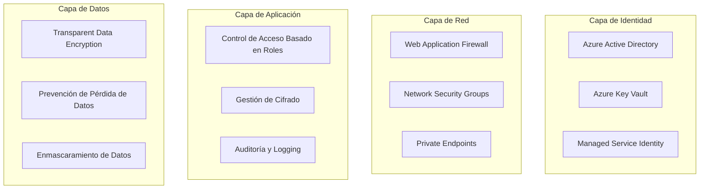

# Guía de Seguridad - MVP Config-Driven Data Pipeline

## Índice
1. [Visión General de Seguridad](#visión-general-de-seguridad)
2. [Arquitectura de Seguridad](#arquitectura-de-seguridad)
3. [Gestión de Identidad y Acceso](#gestión-de-identidad-y-acceso)
4. [Protección de Datos](#protección-de-datos)
5. [Seguridad en Tránsito](#seguridad-en-tránsito)
6. [Auditoría y Monitoreo](#auditoría-y-monitoreo)
7. [Configuración de Seguridad](#configuración-de-seguridad)
8. [Mejores Prácticas](#mejores-prácticas)
9. [Respuesta a Incidentes](#respuesta-a-incidentes)

## Visión General de Seguridad

Este proyecto implementa un enfoque de **seguridad por diseño** con múltiples capas de protección:

- **Principio de Menor Privilegio**: Cada componente tiene solo los permisos mínimos necesarios
- **Defensa en Profundidad**: Múltiples controles de seguridad en cada capa
- **Zero Trust**: Verificación continua de identidad y autorización
- **Cifrado Omnipresente**: Datos cifrados en reposo y en tránsito

## Arquitectura de Seguridad

### Componentes de Seguridad



### Niveles de Clasificación de Datos

| Nivel | Descripción | Ejemplos | Controles |
|-------|-------------|----------|-----------|
| **PUBLIC** | Información pública | Documentación, precios | Ninguno especial |
| **INTERNAL** | Información interna | Métricas, logs | Autenticación |
| **CONFIDENTIAL** | Información confidencial | Datos de clientes | Cifrado + RBAC |
| **RESTRICTED** | Información altamente sensible | PII, datos financieros | Cifrado + Auditoría + MFA |

## Gestión de Identidad y Acceso

### Azure Active Directory (AAD)

#### Grupos de Seguridad

```yaml
# Grupos definidos en terraform/rbac.tf
data_engineers:
  permissions:
    - Key Vault Administrator
    - Storage Blob Data Contributor
    - SQL DB Contributor
    - Event Hubs Data Owner

data_scientists:
  permissions:
    - Key Vault Secrets User (read-only)
    - Storage Blob Data Reader
    - SQL DB Data Reader

data_factory_identity:
  permissions:
    - Key Vault Secrets User
    - Storage Blob Data Contributor
    - SQL DB Contributor
    - Event Hubs Data Owner
```

#### Rol Personalizado: Data Pipeline Operator

```json
{
  "name": "Data Pipeline Operator",
  "description": "Rol mínimo para operaciones de pipeline de datos",
  "permissions": [
    "Microsoft.DataFactory/factories/read",
    "Microsoft.DataFactory/factories/pipelines/read",
    "Microsoft.DataFactory/factories/datasets/read",
    "Microsoft.Storage/storageAccounts/blobServices/containers/read",
    "Microsoft.Storage/storageAccounts/blobServices/containers/blobs/read",
    "Microsoft.KeyVault/vaults/secrets/getSecret/action",
    "Microsoft.EventHub/namespaces/eventhubs/send/action",
    "Microsoft.Sql/servers/databases/connect"
  ],
  "not_actions": [
    "*/delete",
    "Microsoft.Authorization/*/write",
    "Microsoft.KeyVault/vaults/secrets/setSecret/action"
  ]
}
```

### Autenticación Multi-Factor (MFA)

- **Obligatorio** para operaciones administrativas
- **Recomendado** para acceso a datos confidenciales
- **Configurado** mediante Azure Conditional Access

### Gestión de Tokens

```python
from src.utils.security import TokenManager, SecurityContext

# Crear contexto de seguridad
context = SecurityContext(
    user_id="user@company.com",
    session_id="session_123",
    access_level=AccessLevel.WRITE,
    permissions=["read_data", "write_data"],
    expires_at=datetime.utcnow() + timedelta(hours=8)
)

# Generar token JWT
token_manager = TokenManager()
token = token_manager.generate_token(context)

# Verificar token
decoded_context = token_manager.verify_token(token)
```

## Protección de Datos

### Cifrado en Reposo

#### Azure Key Vault
- **Propósito**: Gestión centralizada de secretos, claves y certificados
- **Cifrado**: HSM-backed (FIPS 140-2 Level 2)
- **Acceso**: RBAC + Access Policies

#### SQL Database
- **Transparent Data Encryption (TDE)**: Habilitado por defecto
- **Always Encrypted**: Para columnas sensibles específicas
- **Dynamic Data Masking**: Para datos PII en consultas

#### Azure Storage
- **Cifrado del Servicio**: AES-256 habilitado por defecto
- **Claves gestionadas por cliente**: Opcional para mayor control

### Cifrado en la Aplicación

```python
from src.utils.security import EncryptionManager, DataClassification

# Configurar clasificación de datos
classification = DataClassification(
    level=SecurityLevel.CONFIDENTIAL,
    categories=["financial", "personal"],
    pii_fields=["email", "phone", "credit_card"],
    encryption_required=True
)

# Cifrar datos sensibles
encryption_manager = EncryptionManager()
encrypted_data = encryption_manager.encrypt(sensitive_data, context)

# Cifrar campos específicos
encrypted_email = encryption_manager.encrypt_field(
    "user@example.com", "email"
)
```

### Enmascaramiento de Datos

```python
from src.utils.security import DataMasking

# Enmascarar diferentes tipos de datos
masked_email = DataMasking.mask_email("user@example.com")
# Resultado: "u**r@example.com"

masked_phone = DataMasking.mask_phone("123-456-7890")
# Resultado: "***-***-7890"

masked_cc = DataMasking.mask_credit_card("1234-5678-9012-3456")
# Resultado: "****-****-****-3456"
```

## Seguridad en Tránsito

### TLS/SSL

#### Configuración Mínima
- **TLS 1.2+** obligatorio para todas las conexiones
- **Certificados** gestionados por Azure Key Vault
- **HSTS** habilitado para aplicaciones web

#### Application Gateway con WAF

```hcl
# terraform/security.tf
resource "azurerm_application_gateway" "main" {
  # ... configuración básica ...
  
  waf_configuration {
    enabled          = true
    firewall_mode    = "Prevention"
    rule_set_type    = "OWASP"
    rule_set_version = "3.2"
  }
  
  ssl_policy {
    policy_type = "Predefined"
    policy_name = "AppGwSslPolicy20220101S"
  }
}
```

### Network Security Groups

```hcl
# Denegar todo el tráfico por defecto
resource "azurerm_network_security_rule" "deny_all_inbound" {
  name                       = "DenyAllInbound"
  priority                   = 4096
  direction                  = "Inbound"
  access                     = "Deny"
  protocol                   = "*"
  source_port_range          = "*"
  destination_port_range     = "*"
  source_address_prefix      = "*"
  destination_address_prefix = "*"
}

# Permitir solo HTTPS
resource "azurerm_network_security_rule" "allow_https" {
  name                       = "AllowHTTPS"
  priority                   = 1000
  direction                  = "Inbound"
  access                     = "Allow"
  protocol                   = "Tcp"
  source_port_range          = "*"
  destination_port_range     = "443"
  source_address_prefixes    = var.trusted_ip_ranges
  destination_address_prefix = "*"
}
```

### Private Endpoints

- **SQL Database**: Acceso solo desde VNet
- **Storage Account**: Acceso solo desde VNet
- **Key Vault**: Acceso solo desde VNet
- **Event Hub**: Acceso solo desde VNet

## Auditoría y Monitoreo

### Logging de Auditoría

```python
from src.utils.security import AuditLogger

audit_logger = AuditLogger()

# Log de acceso a recursos
audit_logger.log_access(
    context=security_context,
    resource="customer_database",
    action="read",
    success=True,
    details={"query": "SELECT COUNT(*) FROM customers"}
)

# Log de acceso a datos
audit_logger.log_data_access(
    context=security_context,
    dataset="customer_pii",
    classification=data_classification,
    operation="read",
    record_count=1000
)

# Log de eventos de seguridad
audit_logger.log_security_event(
    event_type="unauthorized_access",
    context=security_context,
    details={"attempted_resource": "admin_panel"}
)
```

### Métricas de Seguridad

```python
from src.utils.logging import MetricsLogger

metrics_logger = MetricsLogger()

# Métricas de acceso
metrics_logger.log_data_quality_metric(
    "security.access_attempts",
    1,
    {"user": user_id, "resource": resource_name, "success": success}
)

# Métricas de cifrado
metrics_logger.log_performance_metric(
    "security.encryption_time",
    encryption_duration,
    {"algorithm": "AES-256", "data_size": data_size}
)
```

### Azure Monitor Integration

```python
from src.utils.azure_integration import get_tracer

tracer = get_tracer("security-service")

with tracer.start_as_current_span("encrypt_sensitive_data") as span:
    span.set_attribute("data.classification", "confidential")
    span.set_attribute("user.id", user_id)
    
    encrypted_data = encrypt_data(sensitive_data)
    
    span.set_attribute("encryption.success", True)
```

## Configuración de Seguridad

### Variables de Entorno

```bash
# Desarrollo Local
export ENCRYPTION_KEY="your-local-encryption-key"
export JWT_SECRET="your-local-jwt-secret"
export AUDIT_LEVEL="INFO"

# Producción (desde Key Vault)
export AZURE_KEY_VAULT_URL="https://your-kv.vault.azure.net/"
export AZURE_CLIENT_ID="your-client-id"
export AZURE_TENANT_ID="your-tenant-id"
```

### Configuración de Políticas

```python
from src.utils.security import SecurityValidator, require_permission

# Decorador para validar permisos
@require_permission("read_customer_data")
def get_customer_info(customer_id: str):
    return customer_service.get_customer(customer_id)

# Decorador para validar clasificación de datos
@require_data_classification(SecurityLevel.CONFIDENTIAL)
def process_sensitive_data(data: dict):
    return data_processor.process(data)
```

### Azure Policies

```hcl
# Requerir TLS 1.2 mínimo
resource "azurerm_policy_assignment" "require_tls_12" {
  name                 = "require-tls-12"
  scope                = azurerm_resource_group.main.id
  policy_definition_id = "/providers/Microsoft.Authorization/policyDefinitions/..."
  
  parameters = jsonencode({
    minimumTlsVersion = {
      value = "TLS1_2"
    }
  })
}
```

## Mejores Prácticas

### Desarrollo Seguro

1. **Nunca hardcodear secretos** en el código
2. **Usar variables de entorno** para configuración
3. **Validar todas las entradas** de usuario
4. **Implementar logging de auditoría** en todas las operaciones críticas
5. **Usar HTTPS** para todas las comunicaciones

### Gestión de Secretos

```python
# ✅ CORRECTO
from src.utils.azure_integration import get_secret
database_password = get_secret("database-password")

# ❌ INCORRECTO
database_password = "hardcoded_password_123"
```

### Validación de Entrada

```python
from src.utils.security import SecurityValidator

validator = SecurityValidator()

def process_user_data(user_input: str, context: SecurityContext):
    # Validar acceso
    validator.validate_access(context, "user_data", "write")
    
    # Sanitizar entrada
    sanitized_input = sanitize_input(user_input)
    
    # Procesar datos
    return process_data(sanitized_input)
```

### Rotación de Claves

- **Claves de cifrado**: Rotación automática cada 90 días
- **Certificados SSL**: Renovación automática 30 días antes del vencimiento
- **Tokens de acceso**: Expiración máxima de 8 horas
- **Contraseñas de servicio**: Rotación manual cada 180 días

## Respuesta a Incidentes

### Detección de Amenazas

#### Indicadores de Compromiso
- Múltiples intentos de acceso fallidos
- Acceso desde ubicaciones geográficas inusuales
- Patrones de acceso a datos anómalos
- Modificaciones no autorizadas de configuración

#### Alertas Automáticas

```python
# Configuración de alertas en Azure Monitor
{
  "alert_rules": [
    {
      "name": "Multiple Failed Logins",
      "condition": "failed_login_count > 5 in 5 minutes",
      "action": "send_notification_and_block_ip"
    },
    {
      "name": "Unusual Data Access",
      "condition": "data_access_volume > baseline * 3",
      "action": "send_security_alert"
    }
  ]
}
```

### Procedimiento de Respuesta

1. **Detección**: Alertas automáticas o reporte manual
2. **Evaluación**: Determinar alcance y severidad
3. **Contención**: Aislar sistemas afectados
4. **Erradicación**: Eliminar la amenaza
5. **Recuperación**: Restaurar servicios normales
6. **Lecciones Aprendidas**: Documentar y mejorar

### Contactos de Emergencia

```yaml
security_team:
  email: "security@company.com"
  phone: "+1-555-SECURITY"
  escalation: "ciso@company.com"

azure_support:
  severity_a: "+1-800-MICROSOFT"
  portal: "https://portal.azure.com/#blade/Microsoft_Azure_Support"
```

### Backup y Recuperación

#### Datos Críticos
- **Backup diario** de bases de datos
- **Replicación geográfica** para alta disponibilidad
- **Pruebas de recuperación** mensuales

#### Configuración
- **Backup de configuración** de infraestructura (Terraform state)
- **Versionado** de código en Git
- **Documentación** actualizada de procedimientos

## Cumplimiento y Certificaciones

### Estándares Implementados
- **ISO 27001**: Gestión de seguridad de la información
- **SOC 2 Type II**: Controles de seguridad y disponibilidad
- **GDPR**: Protección de datos personales
- **CCPA**: Privacidad del consumidor de California

### Auditorías
- **Auditoría interna**: Trimestral
- **Auditoría externa**: Anual
- **Penetration testing**: Semestral
- **Vulnerability scanning**: Continuo

---

## Recursos Adicionales

- [Azure Security Center](https://docs.microsoft.com/en-us/azure/security-center/)
- [Azure Key Vault Best Practices](https://docs.microsoft.com/en-us/azure/key-vault/general/best-practices)
- [OWASP Top 10](https://owasp.org/www-project-top-ten/)
- [NIST Cybersecurity Framework](https://www.nist.gov/cyberframework)

Para preguntas específicas sobre seguridad, contactar al equipo de seguridad: security@company.com