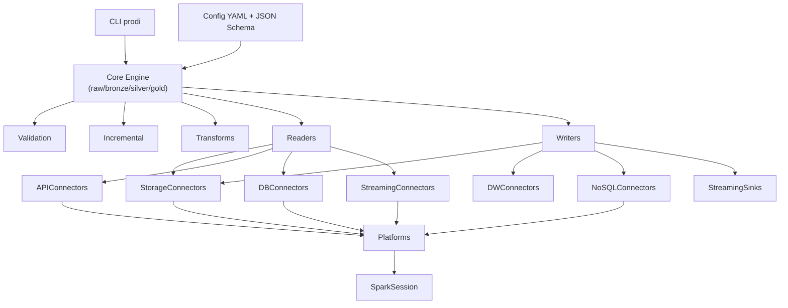
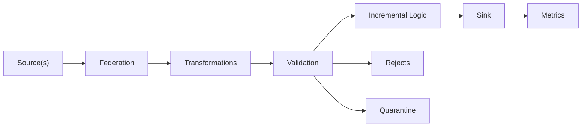

# Arquitectura Datacore

La solución sigue el patrón hexagonal (puertos y adaptadores) para mantener el núcleo desacoplado de las integraciones con cada proveedor cloud.

## Diagrama de arquitectura



## Diagrama de flujo de dataset



## Componentes principales

### CLI (`datacore.cli`)
Expone comandos `prodi validate|run|plan` con soporte para:
- `--dry-run`: Genera plan sin ejecutar
- `--fail-fast`: Detiene al primer error
- `--provision`: Provisiona recursos opcionales (Fabric)
- `--log-level`: Control de verbosidad

**Comandos**:
- `prodi validate --config project.yml`: Valida configuración contra schemas JSON
- `prodi run --layer bronze --config project.yml`: Ejecuta capa específica
- `prodi plan --config project.yml`: Genera plan de ejecución completo

### Core (`datacore.core`)
Motor de ejecución por capas con los siguientes módulos:

#### `engine.py`
Orquestador principal que:
- Resuelve plataforma y construye SparkSession
- Procesa datasets por capa (raw → bronze → silver → gold)
- Gestiona ciclo de vida: lectura → transformación → validación → escritura
- Genera planes declarativos en modo dry-run
- Maneja errores con `fail_fast` opcional

#### `federation.py`
Combina múltiples fuentes mediante:
- **Join**: Inner, left, right, full con proyecciones selectivas
- **Union**: By name o by position, con `allow_missing_columns`

#### `ops.py`
Transformaciones declarativas:
- `trim`, `ltrim`, `rtrim`: Limpieza de espacios
- `uppercase`, `lowercase`: Normalización de casing
- `rename`: Renombrado de columnas
- `cast`: Conversión de tipos
- `deduplicate`: Eliminación de duplicados por keys
- `standardize_dates`: Normalización de fechas
- `explode_array`, `flatten_json`: Expansión de estructuras
- `normalize`: Pipeline de limpieza (trim + lower/upper)

#### `validation.py`
Sistema de calidad de datos con reglas:
- `expect_not_null`: Verificar no nulos
- `expect_unique`: Verificar unicidad
- `expect_range`: Validar rangos numéricos
- `expect_regex`: Validar patrones
- `expect_set`: Validar valores permitidos
- Soporte para severidad (`error`/`warn`)
- Estrategias `on_fail`: `reject`, `quarantine`, `none`

#### `incremental.py`
Lógica de cargas incrementales:
- **Full**: Sobrescribe completo
- **Append**: Solo agrega nuevos registros
- **Merge**: Upsert por keys con Delta Lake

#### `cdc.py`
Change Data Capture para JDBC:
- Modo `timestamp`: Lectura incremental por columna de tiempo
- Modo `version_column`: Lectura por versión
- Persiste watermark en checkpoint para evitar re-procesar

### Conectores (`datacore.connectors`)
Adaptadores para lectura/escritura:

#### Storage
- **S3** (`s3.py`): Amazon S3
- **ABFS** (`abfs.py`): Azure Data Lake Storage Gen2
- **GCS** (`gcs.py`): Google Cloud Storage
- **Local** (`local.py`): Sistema de archivos local / MinIO
- **Fabric** (`fabric.py`): Microsoft Fabric Lakehouse con soporte para `lakehouse://` URIs

Formatos soportados: `csv`, `json`, `parquet`, `avro`, `orc`, `delta`

#### APIs
- **REST** (`api/rest.py`): Paginación cursor/offset/page, autenticación bearer/basic
- **GraphQL** (`graphql.py`): Queries parametrizadas
- **HTTP** (`http.py`): Endpoint genérico con reintentos exponenciales

#### Bases de datos
- **JDBC** (`db/jdbc.py`): PostgreSQL, SQL Server, MySQL, Oracle, Redshift
- Soporte para particionamiento paralelo
- Pushdown de filtros cuando es seguro
- Upserts transaccionales para sinks

#### Streaming
- **Kafka** (`streaming/kafka.py`): Apache Kafka
- **Event Hubs** (`streaming/event_hubs.py`): Azure Event Hubs
- Soporte para watermark y triggers configurables

### Plataformas (`datacore.platforms`)
Inicialización de Spark, secretos y servicios auxiliares:

- **LocalPlatform** (`base.py`): Desarrollo local
- **AzureDatabricksPlatform** (`azure_databricks.py`): Azure Databricks
- **AwsGluePlatform** (`aws_glue.py`): AWS Glue
- **GcpDataprocPlatform** (`gcp_dataproc.py`): GCP Dataproc
- **FabricPlatform** (`fabric.py`): Microsoft Fabric

Cada plataforma implementa:
- `build_spark_session()`: Configuración de Spark por plataforma
- `resolve_secret()`: Resolución de secretos nativos
- `checkpoint_dir()`: Ubicación de checkpoints
- Servicios específicos (ej. provisión de Lakehouse en Fabric)

### IO (`datacore.io`)
Lectura/escritura batch y streaming:

- **Readers** (`readers.py`): Factory para lectura según tipo de source
- **Writers** (`writers.py`): Factory para escritura según tipo de sink
- **Shortcuts** (`shortcuts.py`): Virtualización de fuentes
- Inferencia de esquema con cache por dataset

## Flujo general

### Fase 1: Inicialización
1. CLI carga archivo YAML
2. Valida contra schemas JSON (`project.schema.json` o `layer.schema.json`)
3. Resuelve plataforma y construye SparkSession
4. Determina datasets a procesar por capa

### Fase 2: Lectura de fuentes
1. Para cada dataset, construye mapa de fuentes (`_build_sources_map`)
2. Lee cada source individualmente (`_read_single_source`)
3. Si hay CDC, lee solo cambios desde último watermark
4. Materializa cada source como vista temporal `_src_<id>`

### Fase 3: Federación
1. Si hay múltiples fuentes y `transform.federate`:
   - **Join**: Combina con condiciones y proyecciones
   - **Union**: Unifica con `allowMissingColumns`
2. Si no hay federación pero hay múltiples sources:
   - Union automática con `merge_strategy` para resolver duplicados

### Fase 4: Transformaciones
1. Aplica `transform.sql` (cada statement crea vista temporal)
2. Aplica `transform.udf` (funciones registradas)
3. Aplica `transform.ops` (operaciones declarativas en orden)
4. Agrega `_ingestion_ts` si `add_ingestion_ts: true` (default)

### Fase 5: Validación
1. Ejecuta reglas de validación secuencialmente
2. Separa registros válidos/inválidos
3. Escribe rechazos a `_rejects` si `invalid_rows > 0`
4. Escribe cuarentena a `quarantine_sink` si está configurado
5. Genera métricas por regla

### Fase 6: Incremental
1. Si `incremental.mode: merge`:
   - Lee datos existentes del sink
   - Realiza merge por `keys` usando Delta Lake
2. Si `incremental.mode: append`:
   - Agrega directamente sin leer existentes
3. Si `incremental.mode: full`:
   - Sobrescribe datos existentes

### Fase 7: Escritura
1. Aplica reparticionamiento si está configurado
2. Escribe a sink según tipo:
   - **Storage**: Spark DataFrameWriter
   - **Warehouse**: JDBC batch writer
   - **NoSQL**: Conector específico (CosmosDB, DynamoDB)
   - **Streaming**: Spark Structured Streaming
3. Escribe métricas a `<sink>/_metrics/<run_id>.json`

## Esquema e inferencia

- Los formatos soportados incluyen `csv`, `json`, `parquet`, `avro` y `orc`, con opciones específicas por formato.
- La inferencia de esquema es opcional; cuando está habilitada se cachea por dataset en el checkpoint de plataforma para evitar recalcular tipos en ejecuciones futuras.
- Los esquemas pueden ser:
  - **Inferidos**: `infer_schema: true`
  - **Explícitos**: `schema: {type: struct, fields: [...]}`
  - **Evolucionados**: `merge_schema: true` en sinks

## Transformaciones declarativas

El motor registra operaciones puras en `datacore.core.ops`:
- Renombrar, castear, limpiar whitespace, normalizar fechas
- Deduplicar, explotar arrays, flatten JSON
- Los pipelines pueden combinar `transform.sql`, `transform.udf` y `transform.ops`
- Se añade `transform.add_ingestion_ts` (true por defecto)
- Se soporta `merge_strategy` para múltiples fuentes

> [!WARNING]
> **Breaking change**: el bloque `transform.validation` fue retirado; las reglas deben declararse en `dataset.validation`.

## Incremental, CDC y streaming

### Incremental
- `incremental.mode` soporta `full`, `append` y `merge`
- Merge genérico para cualquier formato, aprovechando Delta Lake cuando está disponible
- Requiere `keys` para merge

### CDC (Change Data Capture)
- Fuentes JDBC con bloque `source.cdc` realizan lecturas incrementales
- Modos: `timestamp`, `version_column`, `log`
- Persiste watermark en checkpoint del dataset
- Evita re-procesar datos ya ingestados

### Streaming
- Sinks JDBC realizan upserts por etapas (tablas temporales + transacciones) cuando se definen `keys`
- Cargas streaming manejan `watermark` (`column` + `delay_threshold`)
- Triggers configurables: `processingTime`, `once`, `continuous`
- Checkpoints por dataset

**Ejemplo streaming**:
```yaml
streaming:
  enabled: true
  watermark:
    column: event_timestamp
    delay_threshold: 10 minutes
  trigger: 30 seconds
  checkpoint_location: abfs://checkpoints/events
```

## Observabilidad

### Métricas
El motor genera métricas JSON en `<sink>/_metrics/<run_id>.json`:
```json
{
  "run_id": "20251124_150800_a1b2c3",
  "dataset": "customers_silver",
  "layer": "silver",
  "total_rows": 10000,
  "valid_rows": 9875,
  "invalid_rows": 125,
  "quarantine_rows": 50,
  "duration_seconds": 42.3,
  "rules": {
    "expect_not_null": {"passed": 9950, "failed": 50},
    "expect_regex": {"passed": 9875, "failed": 125}
  }
}
```

### Rechazos
Registros inválidos se escriben en `<sink>/_rejects/<timestamp>/` con:
- Todas las columnas originales
- Columna `_validation_errors` con motivos

### Planificación
- `prodi plan` y `prodi run --dry-run` devuelven contrato JSON estable:
```json
{
  "run_id": "20251124_150800",
  "created_at": "2025-11-24T15:08:00Z",
  "datasets": [
    {
      "name": "customers_silver",
      "layer": "silver",
      "source_plan": {...},
      "transform_plan": {...},
      "validation_plan": {...},
      "incremental_plan": {...},
      "sink_plan": {...},
      "issues": []
    }
  ]
}
```

### Fail-fast
El flag `--fail-fast` permite abortar al primer error manteniendo logs contextualizados por capa/dataset.

## Próximos pasos

- Explora [configuración](configuration.md) para opciones detalladas
- Revisa [conectores](connectors.md) para backends específicos
- Consulta [casos de uso](use_cases.md) para ejemplos prácticos
