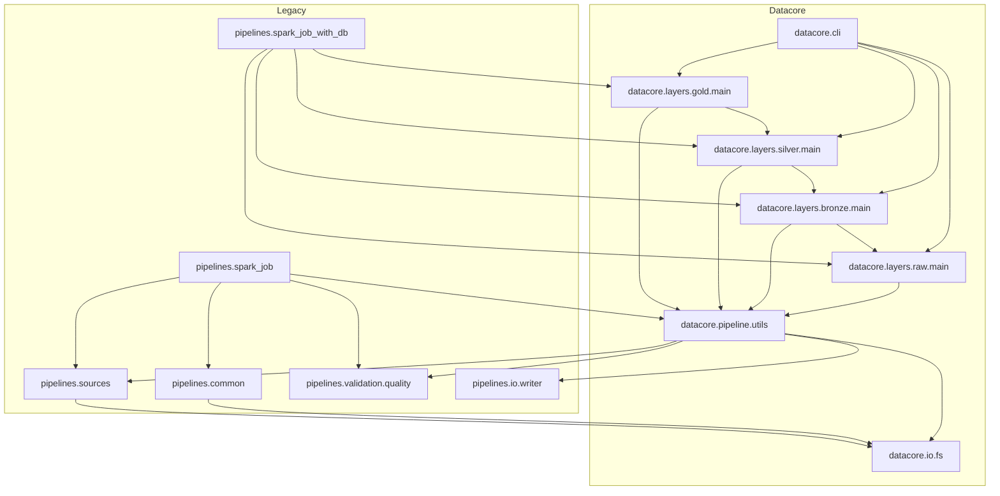

# Diagrama de dependencias de módulos

```mermaid
graph TD
    subgraph Datacore
        CLI[datacore.cli]
        RAW[datacore.layers.raw.main]
        BRONZE[datacore.layers.bronze.main]
        SILVER[datacore.layers.silver.main]
        GOLD[datacore.layers.gold.main]
        PIPEUTILS[datacore.pipeline.utils]
        IOFS[datacore.io.fs]
    end

    subgraph Legacy
        SPJOB[pipelines.spark_job]
        SPJOBDB[pipelines.spark_job_with_db]
        PCOMMON[pipelines.common]
        PSOURCES[pipelines.sources]
        PQUALITY[pipelines.validation.quality]
        PWRITER[pipelines.io.writer]
    end

    CLI --> RAW
    CLI --> BRONZE
    CLI --> SILVER
    CLI --> GOLD

    BRONZE --> RAW
    SILVER --> BRONZE
    GOLD --> SILVER

    RAW --> PIPEUTILS
    BRONZE --> PIPEUTILS
    SILVER --> PIPEUTILS
    GOLD --> PIPEUTILS
    PIPEUTILS --> PSOURCES
    PIPEUTILS --> PQUALITY
    PIPEUTILS --> PWRITER
    PIPEUTILS --> IOFS

    SPJOB --> PCOMMON
    SPJOB --> PSOURCES
    SPJOB --> PQUALITY
    SPJOB --> PIPEUTILS

    SPJOBDB --> RAW
    SPJOBDB --> BRONZE
    SPJOBDB --> SILVER
    SPJOBDB --> GOLD

    PCOMMON --> IOFS
    PSOURCES --> IOFS
```

> Nota: las flechas apuntan desde el módulo que importa hacia el módulo que es importado.
