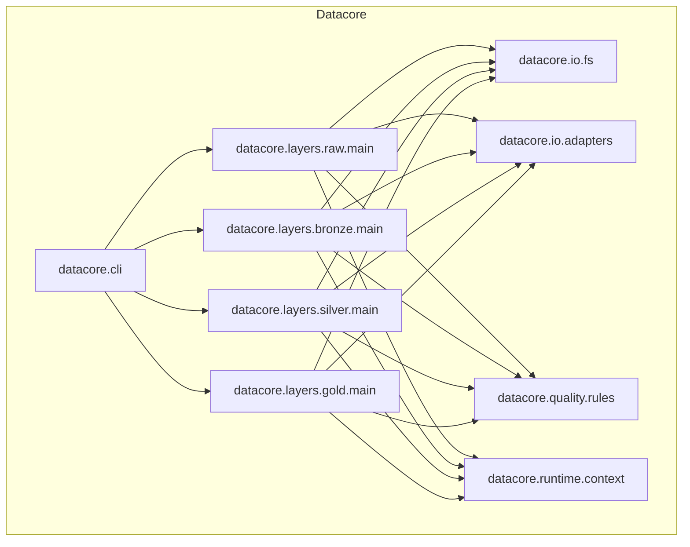

# Diagrama de dependencias de módulos

```mermaid
graph TD
    subgraph Datacore
        CLI[datacore.cli]
        RAW[datacore.layers.raw.main]
        BRONZE[datacore.layers.bronze.main]
        SILVER[datacore.layers.silver.main]
        GOLD[datacore.layers.gold.main]
        IOFS[datacore.io.fs]
        IOADP[datacore.io.adapters]
        QUALITY[datacore.quality.rules]
        RUNTIME[datacore.runtime.context]
    end

    CLI --> RAW
    CLI --> BRONZE
    CLI --> SILVER
    CLI --> GOLD

    RAW --> IOFS
    RAW --> IOADP
    BRONZE --> IOFS
    BRONZE --> IOADP
    SILVER --> IOFS
    SILVER --> IOADP
    GOLD --> IOFS
    GOLD --> IOADP

    RAW --> QUALITY
    BRONZE --> QUALITY
    SILVER --> QUALITY
    GOLD --> QUALITY

    RAW --> RUNTIME
    BRONZE --> RUNTIME
    SILVER --> RUNTIME
    GOLD --> RUNTIME
```

> No existen nodos legacy; cualquier referencia nueva a `pipelines` es considerada regresión.
