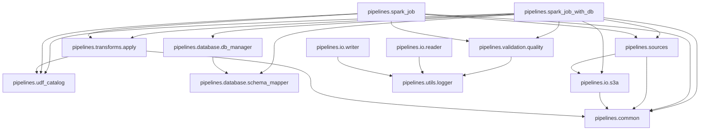

# Grafo de imports internos (pipelines)

```mermaid
graph TD
  spark_job_with_db["pipelines.spark_job_with_db"] --> common["pipelines.common"]
  spark_job_with_db --> sources["pipelines.sources"]
  spark_job_with_db --> quality["pipelines.validation.quality"]
  spark_job_with_db --> transforms_apply["pipelines.transforms.apply"]
  spark_job_with_db --> udf_catalog["pipelines.udf_catalog"]
  spark_job_with_db --> db_manager["pipelines.database.db_manager"]
  spark_job_with_db --> schema_mapper["pipelines.database.schema_mapper"]
  spark_job_with_db --> io_s3a["pipelines.io.s3a"]
  spark_job["pipelines.spark_job"] --> common
  spark_job --> quality
  spark_job --> transforms_apply
  spark_job --> udf_catalog
  spark_job --> sources
  sources --> common
  sources --> io_s3a
  quality --> utils_logger["pipelines.utils.logger"]
  io_reader["pipelines.io.reader"] --> utils_logger
  io_writer["pipelines.io.writer"] --> utils_logger
  io_s3a --> common
  transforms_apply --> common
  transforms_apply --> udf_catalog
  db_manager --> schema_mapper
```
