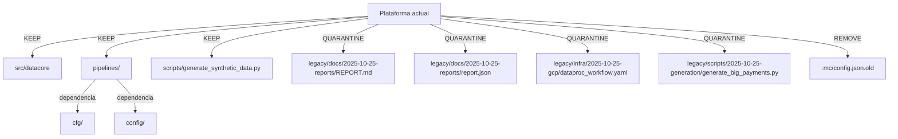

# Impacto de limpieza

| Activo | Ubicación anterior | Ubicación actual | Estado |
| --- | --- | --- | --- |
| Reporte operativo | `docs/REPORT.md` | `legacy/docs/2025-10-25-reports/REPORT.md` | Quarantine |
| Resumen JSON | `docs/report.json` | `legacy/docs/2025-10-25-reports/report.json` | Quarantine |
| Workflow Dataproc | `docs/run/jobs/dataproc_workflow.yaml` | `legacy/infra/2025-10-25-gcp/dataproc_workflow.yaml` | Quarantine |
| Script generación pagos | `scripts/generate_big_payments.py` | `legacy/scripts/2025-10-25-generation/generate_big_payments.py` | Quarantine |
| Config antigua | `.mc/config.json.old` | Eliminado | Remove |

El diagrama resalta los artefactos trasladados a `legacy/` y la eliminación aplicada. Sigue la política DEP-001 para cuarentena de 30 días con reversibilidad documentada.
