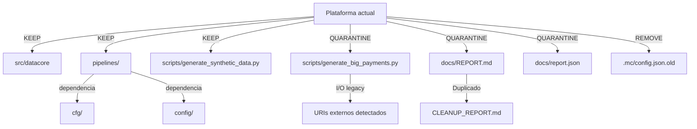

# Impacto de limpieza

```mermaid
graph TD
    A[Plataforma actual] -->|KEEP| B[src/datacore]
    A -->|KEEP| C[pipelines/]
    A -->|KEEP| D[scripts/generate_synthetic_data.py]
    A -->|QUARANTINE| E[scripts/generate_big_payments.py]
    A -->|QUARANTINE| F[docs/REPORT.md]
    A -->|QUARANTINE| G[docs/report.json]
    A -->|REMOVE| H[.mc/config.json.old]
    C -->|dependencia| I[cfg/]
    C -->|dependencia| J[config/]
    E -->|I/O legacy| K[URIs externos detectados]
    F -->|Duplicado| L[CLEANUP_REPORT.md]
```

El diagrama resalta scripts y documentos legacy identificados, y su relación con los artefactos activos propuestos para conservar.
