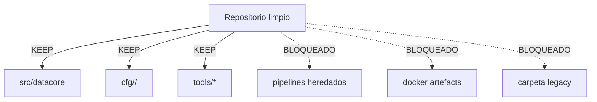

# Impacto de la purga final

Todos los artefactos legacy fueron eliminados; no existe carpeta `legacy` ni monolito pipelines heredado.

| Activo retirado | Ubicación original | Acción |
| --- | --- | --- |
| Monolito Spark | pipelines heredado | Eliminado |
| Artefactos Docker | builds Docker, manifests compose, `docker/`, `.docker/` | Eliminados |
| Reportes cuarentenados | legacy docs (2025-10-25-reports) | Eliminados |
| Scripts Docker runners | `scripts/runner*.sh` | Eliminados |

CI ejecuta `tools/audit_cleanup.py --check` para fallar si reaparecen los nodos bloqueados.
